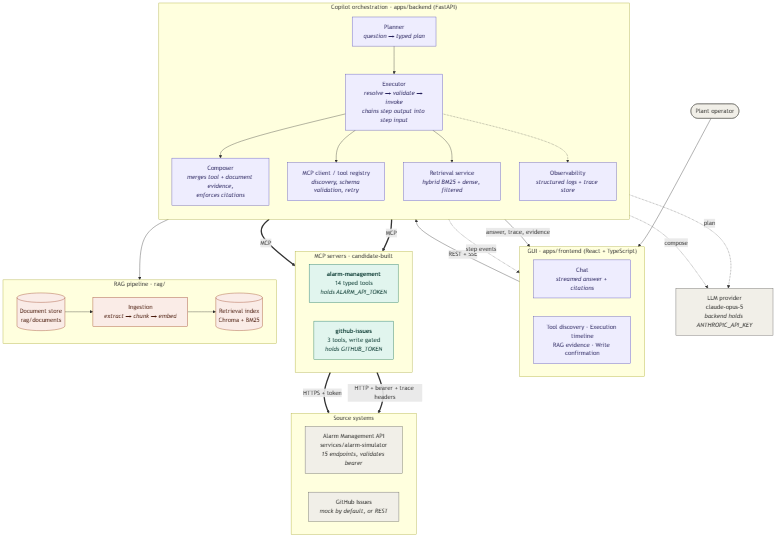

# Multi-MCP Enterprise Operations Copilot

A copilot for plant operators. It answers natural-language questions by calling an Alarm
Management API **through purpose-built MCP servers**, retrieving supporting passages from
an operations document corpus, and merging both into a single grounded answer that
carries citations and a visible execution trace.

```bash
git clone <repository-url> && cd senior-copilot-mcp-rag-assignment
cp .env.example .env
docker compose up --build
```

Then open **http://localhost:5173** and ask the acceptance question. No API key is
required — the stack defaults to a deterministic provider that runs the same workflow
without an LLM. Set `LLM_PROVIDER=anthropic` and `ANTHROPIC_API_KEY` for generated prose.

---

## 1 · Selected use case

**Multi-MCP Enterprise Operations Copilot.** The copilot discovers and coordinates tools
across two MCP servers rather than hard-coding integrations, and combines that structured
data with unstructured document evidence in one workflow.

The mandatory acceptance scenario:

> Investigate recurring high-severity alarms for Boiler Feed Pump 101 over the last 90
> days, identify likely contributing factors, retrieve the relevant operating procedure,
> and provide recommended actions with source evidence.

That scenario runs as an automated test
([`tests/e2e/test_acceptance_scenario.py`](tests/e2e/test_acceptance_scenario.py)) which
asserts, over the real HTTP surface, that five steps execute, that step 2 received the
asset id step 1 produced, that retrieval was narrowed by the asset name step 1 resolved,
and that the answer contains both a `[tool: …]` and a `[source: …]` marker.

### A note on the source system

The Alarm Management API described in the brief does not exist as a running service — the
supplied Postman collections **are** its specification. So it is built here too, as
[`services/alarm-simulator/`](services/alarm-simulator): 15 endpoints, bearer auth, trace
headers, an error envelope, and deterministic seeded data engineered so that every
chaining assertion in the supplied collections returns non-empty results. `make contract`
runs all three collections against it; CI does the same on every push.

## 2 · Main capabilities

- Natural-language chat over live alarm data and operations documents
- Runtime tool discovery across two MCP servers — no hard-coded tool list
- Multi-step tool chaining, where one tool's output becomes the next tool's input
- Hybrid document retrieval (BM25 + dense vectors, fused by reciprocal rank) with inline
  citations
- **One** answer combining structured tool results and unstructured document evidence
- Full execution trace: which server, which tool, what arguments, how long, what outcome
- Explicit human confirmation before any write, enforced in the tool contract
- Graceful degradation on tool failure, timeout, invalid schema, empty retrieval, model
  refusal, or a missing API key

## 3 · Technology stack

| Layer | Choice |
| --- | --- |
| Backend / orchestration | Python 3.11, FastAPI, SSE |
| MCP | Official MCP Python SDK — two candidate-built servers, 17 tools |
| Source system | FastAPI + SQLAlchemy + SQLite simulator, built to the Postman contract |
| LLM | `claude-opus-5` via the `anthropic` SDK, behind a swappable `LLMProvider` protocol |
| Retrieval | Chroma (embedded) + `rank-bm25`, fused by reciprocal rank |
| Frontend | React 18 + TypeScript (Vite), nginx in the image |
| Packaging | Docker Compose (5 services), GitHub Actions CI |
| Quality | pytest (260 tests, 89% coverage), ruff incl. security rules, mypy, newman contract checks |

## 4 · Architecture summary

Five services. The GUI talks to a FastAPI orchestrator over REST and SSE. The
orchestrator plans a sequence of steps against a tool registry it discovered at runtime
from two MCP servers, resolves each step's arguments (including values produced by
earlier steps), runs document retrieval as one of those steps, and composes one cited
answer.

```
Browser ──HTTP/SSE──▶ backend ──MCP──▶ mcp-alarm-management ──HTTPS+bearer──▶ alarm-simulator
                         │      └────▶ mcp-github-issues    ──────────────▶ GitHub (mocked)
                         └─embedded──▶ Chroma index over rag/documents
```

Only the MCP servers hold credentials for the systems behind them. **The copilot never
calls the Alarm Management API directly**, so the language model has no code path to the
bearer token — it cannot read it, request it, or be prompt-injected into revealing it.

- Request flow end to end: [`docs/architecture.md`](docs/architecture.md)
- Components, ADRs, NFRs, risks, traceability: [`docs/hld.md`](docs/hld.md)
- Schemas, signatures, algorithms, state machines: [`docs/lld.md`](docs/lld.md)



## 5 · MCP servers and tools

Two candidate-built servers. Full contracts — including input/output schemas, auth
behaviour, error behaviour, timeouts, and **real** example requests and responses — are
in [`docs/mcp-tool-catalog.md`](docs/mcp-tool-catalog.md), which is generated from a live
`list_tools()` call and checked in CI, so it cannot drift from the code.

### `alarm-management` — 14 tools

| Tool | Purpose |
| --- | --- |
| `search_assets` | Resolve a free-text equipment name to asset records. Start here. |
| `get_asset_metadata` | Full attributes and current alarm counts for one asset |
| `get_alarms` | Filtered, paginated, sorted alarm list |
| `get_alarm_by_id` | One alarm in full |
| `get_alarm_summary` | Aggregated counts and KPIs, grouped |
| `get_alarm_trends` | Bucketed time series |
| `get_alarm_correlation` | Which alarms fire together, with support / confidence / lift |
| `get_flood_analysis` | Periods where alarm rate exceeded operator capacity |
| `get_rationalization_candidates` | Alarms that warrant re-tuning or suppression |
| `get_priority_score` | Weighted priority for one alarm |
| `get_operator_recommendations` | Recommended actions plus asset and historical context |
| `generate_calculation` | Prepare a named calculation over a scope |
| `execute_calculation` | Run a prepared calculation |
| `get_kpi_definitions` | What each KPI means and how it is computed |

### `github-issues` — 3 tools

| Tool | Purpose |
| --- | --- |
| `search_issues` | Read-only duplicate check |
| `draft_issue` | Pure function — composes title, body, and labels. Writes nothing. |
| `create_issue` | **Refuses with `CONFIRMATION_REQUIRED` unless `confirmed: true`** |

### Running one on its own

```bash
python -m alarm_mcp                      # stdio, for a local MCP client
python -m alarm_mcp --transport http     # streamable HTTP, as in compose
python scripts/mcp_smoke.py              # chain two tools, no GUI and no LLM
```

## 6 · RAG corpus and ingestion

10 markdown documents (operating procedures, troubleshooting guides, standards, a safety
instruction, a vendor bulletin) → 49 heading-aligned chunks → embedded Chroma index.

```bash
python -m rag.ingestion.cli --docs ./rag/documents --reset
```

Retrieval fuses BM25 with dense vectors, filters by the asset an earlier tool call
resolved, and reports `low_confidence` rather than dressing up a weak match. One corpus
document contains a **live prompt-injection payload** so the trust boundary is tested
rather than claimed.

Full design — chunking, metadata, fusion, citation construction, confidence, injection
defence, refresh: [`docs/rag-design.md`](docs/rag-design.md).

## 7 · Configuration

Every value is an environment variable. [`.env.example`](.env.example) documents each key
with a safe placeholder; **no secret is committed, and none is needed to run the demo**.

| Key | Default | Effect |
| --- | --- | --- |
| `LLM_PROVIDER` | `rule_based` | `anthropic` for generated prose; falls back if the key is absent |
| `ANTHROPIC_API_KEY` | `replace-me` | Required only for `LLM_PROVIDER=anthropic` |
| `ALARM_API_TOKEN` | `demo-token` | Bearer token, held only by the MCP server |
| `EMBEDDING_MODEL` | `hashing` | Or a sentence-transformers model with the `rag-transformers` extra |
| `RETRIEVAL_MIN_SCORE` | `0.35` | Below this, the answer states that no relevant procedure was found |
| `GITHUB_MOCK` | `true` | In-memory issue backend; no credentials, no network |

Full reference with types, defaults, and consuming service: [`docs/lld.md`](docs/lld.md) §9.

## 8 · Build and run

`make` is canonical and is what CI uses. On Windows without `make`, `tasks.ps1` exposes
the same target names.

| Task | make | PowerShell |
| --- | --- | --- |
| Install (editable, with dev tools) | `make install` | `.\tasks.ps1 install` |
| Lint (ruff, incl. security rules) | `make lint` | `.\tasks.ps1 lint` |
| Type-check (mypy) | `make typecheck` | `.\tasks.ps1 typecheck` |
| Start the stack | `make up` | `.\tasks.ps1 up` |
| Stop the stack and remove volumes | `make down` | `.\tasks.ps1 down` |
| Build the RAG index | `make ingest` | `.\tasks.ps1 ingest` |
| MCP smoke test | `make smoke` | `.\tasks.ps1 smoke` |
| Regenerate docs | `make docs` | `.\tasks.ps1 docs` |

Ports: GUI `5173`, backend `8080`, simulator `8000` (exposed so the Postman collections
can run against it), MCP servers `9000` / `9001` (internal).

If one of those is already taken, override the host side in `.env` — the container ports
never change. Set `VITE_API_BASE_URL` to match the backend port, because Vite inlines it
into the GUI at build time:

```bash
BACKEND_HOST_PORT=8090 VITE_API_BASE_URL=http://localhost:8090 docker compose up --build
```

Without Docker: `make install`, then run the four Python services in separate terminals —
`uvicorn alarm_simulator.main:app --port 8000`, `python -m alarm_mcp --transport http`,
`python -m github_mcp --transport http`, `make ingest`, `uvicorn
copilot_backend.api.app:app --port 8080` — and `npm run dev` in `apps/frontend`.

## 9 · Tests

| Task | make | PowerShell |
| --- | --- | --- |
| Everything (no running services needed) | `make test` | `.\tasks.ps1 test` |
| Unit only | `make test-unit` | `.\tasks.ps1 test-unit` |
| Integration (MCP client ↔ real servers) | `make test-integration` | `.\tasks.ps1 test-integration` |
| End-to-end acceptance scenario | `make test-e2e` | `.\tasks.ps1 test-e2e` |
| Coverage report | `make coverage` | `.\tasks.ps1 coverage` |
| API contract vs Postman | `make contract` | `.\tasks.ps1 contract` |

`make contract` requires newman (`npm install -g newman`) and a running simulator.

**260 tests, all passing, 89% line coverage.** What they cover:

| Area | Examples |
| --- | --- |
| Simulator contract | Every endpoint's shape, filters, pagination, auth, trace headers, error envelope |
| Analytics | Correlation, flood detection, rationalization, priority scoring, KPI formulas |
| Connector | Request construction, auth injection, 4xx/5xx → typed exceptions, retry on 5xx only |
| MCP server | Discovery, schema validation, auth headers, error mapping, trace propagation |
| MCP client | Connectivity, invalid arguments rejected pre-network, unknown tool, partial failure, degraded server |
| RAG | Ingestion, chunking, metadata, filtering, citations, low confidence, **prompt injection** |
| Orchestration | Chaining, RAG in the same workflow, skipped dependents, pruned hallucinated tools, write approval |
| LLM providers | Plan typing, cache-breakpoint placement, removed sampling params, **`stop_reason == "refusal"`** |
| End-to-end | The acceptance scenario over HTTP, including "no secret appears anywhere in the response" |

The LLM is mocked everywhere, including end to end, so the suite is fast, free, and
repeatable. See [`docs/known-limitations.md`](docs/known-limitations.md) for what that
means.

## 10 · Sample interactions

**Recurring alarms (the acceptance scenario).** Five steps: resolve the asset → summarise
its high-severity alarms → correlate co-occurring pairs → find rationalization candidates
→ retrieve the procedure, filtered by the asset just resolved. The answer reports that
*Discharge Pressure Low is followed by Suction Strainer DP High 31 times (lift 2.29, mean
lag 393s)* `[tool: alarm-management/get_alarm_correlation]` and pairs it with the
isolation and inspection steps from `[source: OP-BFP-101#…]`.

**Operator response efficiency.** `generate_calculation` → `execute_calculation` (chained
on `calculation_id`) → trend of acknowledgement delay → the applicable standard from
`STD-OPRESP`.

**Escalation.** Active alarms → priority score on the top one → recommended actions with
related-alarm context → the matching alarm-philosophy section.

**Filing an issue.** Alarm summary → duplicate check → `draft_issue`. `create_issue` stops
the run with `confirmation.required`; the GUI shows the exact arguments and only proceeds
after approval. The MCP server refuses regardless of what the UI does.

**A question with no supporting document.** Retrieval reports `low_confidence`; the answer
says plainly that no relevant procedure was found instead of substituting general
knowledge.

## 11 · Repository layout

```
apps/backend/          FastAPI orchestrator, MCP client, LLM providers
apps/frontend/         React + TypeScript GUI
mcp-servers/           alarm-management (14 tools), github-issues (3 tools)
services/              alarm-simulator — the candidate-built source system
connectors/alarm_api/  Reusable HTTP client, deliberately separate from the MCP server
packages/schemas/      Shared Pydantic tool contracts
rag/                   documents, ingestion, retrieval, tests
tests/                 unit, integration, e2e
docs/                  architecture, HLD, LLD, tool catalog, RAG design, decisions, limits
postman/               The supplied collections — the Alarm API specification
```

Two documented deviations from the structure in the submission guidelines §3:

- **`services/alarm-simulator/`** — the brief separately mandates a candidate-built
  backend, which is not one of the pre-named folders. Keeping the simulator (the system
  under integration) separate from `connectors/` (the client that reaches it) is a
  cleaner separation than folding both together.
- **`docs/hld.md`** and **`docs/lld.md`** — added alongside the required
  `docs/architecture.md`, which remains the entry point.

The guidelines permit equivalent structures when clearly documented. Because the mandated
directory names are hyphenated and therefore not valid Python package names, each holds a
correctly-named package (`mcp-servers/alarm-management/alarm_mcp/`) mapped to a top-level
import in `pyproject.toml`.

## 12 · Assumptions

1. **The Alarm Management API does not exist**, so the Postman collections are treated as
   its specification and the simulator is built to satisfy them exactly. Where the
   collections were silent (for example, the filters that appear only in the chaining
   collection), the collection's assertions are the authority.
2. **Alarm ids, asset ids, and timestamps are reproducible.** The seed is fixed, so a
   demo, a test, and a Postman run all see the same data.
3. **Correlation means co-occurrence within a lag window on the same asset.** Statistical
   significance testing is out of scope for synthetic data.
4. **One tenant, one site estate.** No tenant identifier is threaded through retrieval or
   tool authorisation.
5. **The GUI-to-backend hop is unauthenticated**, which is acceptable for a local demo and
   is called out in the limitations.
6. **`docker compose up` is the supported path.** The manual path is documented in §8 but
   the compose file is what CI exercises.

## 13 · Known limitations

Honest scope boundaries, each with what would be done differently with more time:
[`docs/known-limitations.md`](docs/known-limitations.md).

## 14 · Demo video

`docs/demo.md` describes the recorded walkthrough: the acceptance scenario end to end,
tool discovery with schema inspection, the execution timeline, citation chips resolving
to evidence, the write-confirmation gate, and then the failure path — the simulator is
stopped mid-session to show retry, degraded answers, and honest gaps.

## License

MIT — see [LICENSE](LICENSE).
