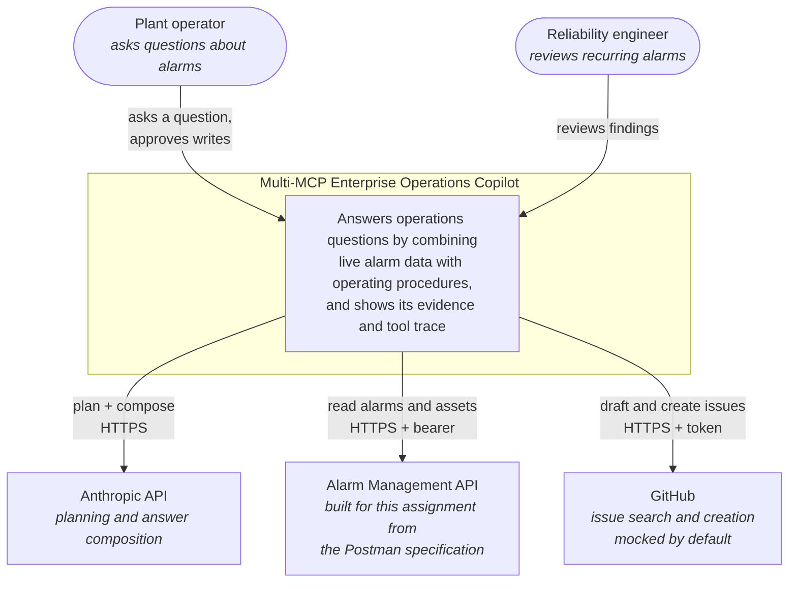
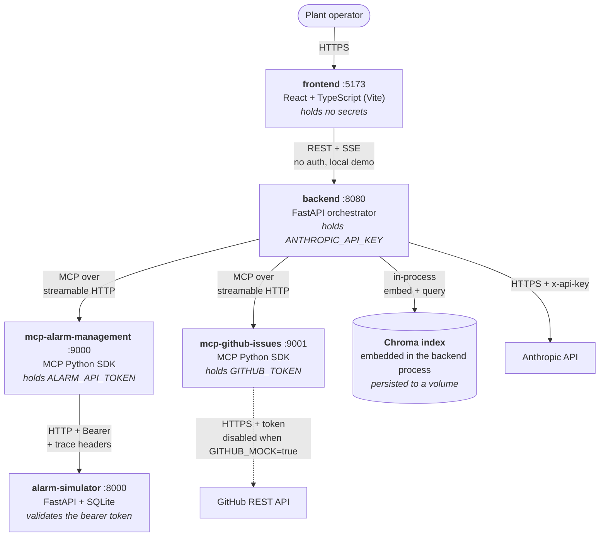
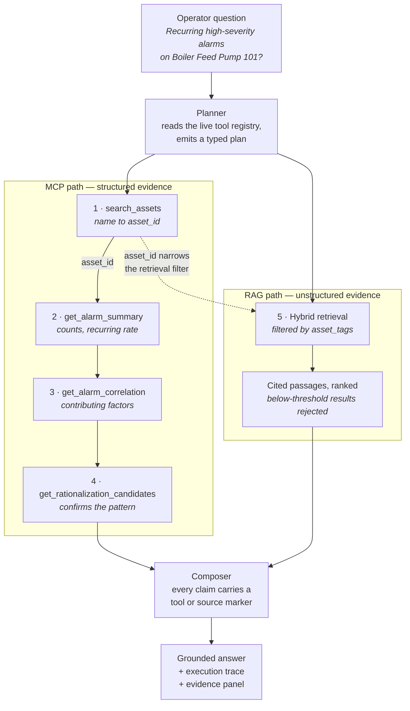

# High-Level Design

**Multi-MCP Enterprise Operations Copilot**

| | |
|---|---|
| Status | Baseline, written before implementation |
| Companion | [`lld.md`](lld.md) — module-level design, authored per component |
| Entry point | [`architecture.md`](architecture.md) — request-flow walkthrough |
| Diagram sources | [`diagrams/`](diagrams/) — Mermaid, exported by `make docs` |

---

## 1. Introduction

### 1.1 Purpose

This document defines the system-level design: what the components are, where the
boundaries sit, how data and trust flow across them, and which decisions were made
deliberately rather than by default. It is written **before** implementation so it can
be argued with rather than merely reflect what happened to get built.

### 1.2 Scope

In scope: an operator-facing copilot that answers questions by combining live alarm
data (reached through candidate-built MCP servers) with an operations document corpus
(reached through retrieval), plus the Alarm Management API simulator that the brief
requires the candidate to build from the supplied Postman collections.

Out of scope: real plant connectivity, multi-tenancy, horizontal scale, SSO, and any
production data. Section 2.4 states these explicitly.

### 1.3 Audience

The assessing engineer, and any engineer who has to run, extend, or debug the system
from a clean clone.

### 1.4 Glossary

| Term | Meaning in this system |
|---|---|
| **Alarm** | A single abnormal-condition event on an asset, with severity, timestamps, and an acknowledgement delay |
| **Asset** | A physical item of plant equipment (pump, compressor, motor), identified by `asset_id` |
| **Unit / Site** | Organisational groupings of assets. A site (`NorthPlant`) contains units (`Unit 2`) |
| **Alarm flood** | More alarms in a rolling window than an operator can process — a recognised failure mode in alarm management |
| **Rationalisation** | Reviewing alarms that recur excessively or sit stale, to decide whether they should be re-tuned or suppressed |
| **MCP** | Model Context Protocol. A standard for exposing typed tools to a language model over a process boundary |
| **MCP server** | A process that advertises tools and executes them. Holds the credentials for the system behind it |
| **MCP client** | The component inside the copilot that discovers tools at runtime and invokes them |
| **RAG** | Retrieval-Augmented Generation. Fetching relevant document passages and grounding the answer in them |
| **Chunk** | A retrievable passage of a document, carrying its own metadata and a nameable section heading |
| **Plan** | A typed, inspectable sequence of steps the orchestrator will execute for one question |
| **Trace** | The correlation identifier threaded from the GUI request through every tool call to the source system |

### 1.5 Reference documents

- `Assignment_Use_Case.md` — the brief
- `Submission_and_Evaluation_Guidelines.md` — submission structure and scoring
- `postman/` — the Alarm Management API specification (three collections)

---

## 2. Requirements

### 2.1 Functional requirements

Each requirement carries an ID used in the traceability matrix (§12). The Source
column cites the section of the brief or guidelines that mandates it.

| ID | Requirement | Source |
|---|---|---|
| FR-01 | Accept natural-language operator questions | Brief §5 |
| FR-02 | Detect intent and produce an execution plan, not a hard-coded sequence | §3, §5 |
| FR-03 | Discover MCP tools at runtime across ≥2 servers | §2.2, §4 |
| FR-04 | Invoke tools with schema-validated arguments | §2.2 |
| FR-05 | Chain tools so one step's output becomes another's input | §2.2, §4 |
| FR-06 | Execute a chain that spans more than one MCP server | §4 |
| FR-07 | Ingest a document corpus with text extraction | §2.3 |
| FR-08 | Chunk documents and capture per-chunk metadata | §2.3 |
| FR-09 | Build a retrieval index (embeddings or equivalent) | §2.3 |
| FR-10 | Filter retrieval by metadata | §2.3 |
| FR-11 | Attach source citations to the answer | §2.3, §4 |
| FR-12 | Generate answers grounded in retrieved evidence | §2.3 |
| FR-13 | Handle no-result and low-confidence retrieval explicitly | §2.3 |
| FR-14 | Treat retrieved document content as data, never as instructions | §2.3 |
| FR-15 | Combine MCP and RAG evidence in a single workflow | §2.4 |
| FR-16 | Retain conversation context across turns | §5 |
| FR-17 | Return structured final responses | §5 |
| FR-18 | Handle invalid tool inputs | §2.2 |
| FR-19 | Handle unavailable tools and servers | §2.2 |
| FR-20 | Handle partial failure mid-chain | §2.2 |
| FR-21 | Display MCP execution detail in the GUI | §2.2, §4 |
| FR-22 | Show which server and tool handled each step | §4 |
| FR-23 | Handle authentication inside the MCP server | §2.1 |
| FR-24 | Apply timeout and retry policy | §2.1 |
| FR-25 | Map source-system errors to understandable MCP errors | §2.1 |
| FR-26 | Propagate correlation/trace metadata end to end | §2.1 |
| FR-27 | Handle pagination | Guidelines §6 |
| FR-28 | Never expose secrets in logs or responses | §2.1 |
| FR-29 | Run and test each MCP server independently | §2.1 |
| FR-30 | Require explicit confirmation before any write | Guidelines §17 |
| FR-31 | Provide chat, tool discovery, execution timeline, schema inspection, evidence panel, and failure states | §4 |
| FR-32 | Build an Alarm Management API simulator conforming to the Postman contract | §1 |

### 2.2 Non-functional requirements

Targets are measurable so they can be checked rather than asserted.

| ID | Requirement | Target | How it is verified |
|---|---|---|---|
| NFR-01 | MCP tool-call latency | p95 < 800 ms against the local simulator | Timing recorded on every `ToolResult`; asserted in integration tests |
| NFR-02 | Retrieval latency | p95 < 300 ms for the demo corpus | Timed in retrieval tests |
| NFR-03 | Orchestration overhead excluding LLM time | < 2 s end to end | Sum of step durations in the trace |
| NFR-04 | Secret exposure | Zero secrets in logs, traces, or API responses | Redaction unit test plus a repo-wide credential scan in CI |
| NFR-05 | Reproducibility | A fixed seed produces identical asset and alarm IDs | Seed test asserts known IDs |
| NFR-06 | Cold start | `docker compose up --build` from a clean clone reaches a working UI | Documented steps followed verbatim |
| NFR-07 | Offline capability | Everything except LLM calls runs with no internet | `LLM_PROVIDER=rule_based` path |
| NFR-08 | Test depth | Every failure mode named in the guidelines has a test | Test matrix, LLD §10 |
| NFR-09 | Observability completeness | All 13 graded fields present on every tool invocation | Telemetry schema test |
| NFR-10 | Type safety | Typed contracts at every boundary | `mypy` in CI; Pydantic at runtime |

### 2.3 Constraints

- Solo build against a suggested 10–14 hour time box; the realistic estimate for the
  full scope including design documentation is ~24 hours. Depth is prioritised over
  breadth accordingly.
- The copilot **must not** call the Alarm Management API directly. Every access goes
  through an MCP server. This is a stated automatic-failure condition.
- The simulator must satisfy the Postman collections exactly — they are the
  specification, not a suggestion.
- No managed cloud services. The only external dependency is the Anthropic API, and
  even that is optional at runtime.

### 2.4 Out of scope

Multi-tenancy; horizontal scaling; real plant or historian connectivity; SSO or OAuth
against the alarm API; production-grade secret management; alarm write-back to the
control system; internationalisation.

---

## 3. System context (C4 level 1)

Source: [`diagrams/c1-system-context.mmd`](diagrams/c1-system-context.mmd)

The Alarm Management API sits outside the system boundary conceptually — the copilot
integrates with it as a third-party source — even though this assignment also requires
us to build it. Keeping that conceptual separation is what makes the integration
honest: the MCP server may only use its published HTTP contract, never a shortcut into
its database.

---

## 4. Container view (C4 level 2)

Source: [`diagrams/c2-container.mmd`](diagrams/c2-container.mmd)

**Secret custody is the load-bearing property of this diagram.** Each credential lives
in exactly one process, and that process is not the one running the language model.

---

## 5. Component responsibilities

| Component | Responsibility | Depends on | Depended on by | Why it is separate |
|---|---|---|---|---|
| `apps/frontend` | Chat, tool discovery, execution timeline, evidence panel, confirmation dialog | backend REST/SSE | — | Presentation must be swappable without touching orchestration |
| `apps/backend/orchestrator` | Plan, resolve, execute, compose | mcp_client, retrieval, llm | api | The business workflow; the only place that knows what a "question" means |
| `apps/backend/mcp_client` | Tool discovery, schema validation, invocation, retry, uniform result envelope | MCP servers | orchestrator, api | Isolates protocol mechanics so the orchestrator reasons about tools abstractly |
| `apps/backend/llm` | `LLMProvider` protocol plus concrete providers | Anthropic SDK | orchestrator | Vendor lock-in is a scored risk; the protocol makes the provider replaceable |
| `apps/backend/api` | HTTP surface, SSE streaming, telemetry emission | orchestrator | frontend | Transport concerns kept out of the workflow |
| `mcp-servers/alarm-management` | Expose 14 alarm capabilities as typed MCP tools; hold the API token | connectors/alarm_api | mcp_client | Independently runnable and testable; the security boundary |
| `mcp-servers/github-issues` | Issue search, drafting, and gated creation | GitHub backend | mcp_client | Second server proves the multi-server architecture is real |
| `connectors/alarm_api` | HTTP client: auth injection, trace headers, timeout, retry, typed errors | Alarm API | alarm-management MCP | Reusable connector, separate from tool semantics |
| `services/alarm-simulator` | The Alarm Management API itself | — | connectors | The system under integration; must be reachable only over its HTTP contract |
| `rag/ingestion` | Load, extract, chunk, embed, index | document store | ingestion CLI | Offline batch concern, unrelated to request handling |
| `rag/retrieval` | Hybrid search, filtering, thresholding, citation construction | Chroma, BM25 | orchestrator | Query-time concern with a different lifecycle from ingestion |
| `packages/schemas` | Shared Pydantic models | — | everything | One definition of every cross-boundary type |

The rightmost column is deliberate. A component that cannot justify its own existence
in one sentence should be merged into its neighbour.

---

## 6. Architectural decisions

### ADR-01 — The simulator is its own service

**Context.** The brief requires a candidate-built Alarm Management API, but the
mandated repository structure has no folder for it. `connectors/` is the obvious
dumping ground.

**Options.** (a) Put the simulator in `connectors/`. (b) Give it `services/alarm-simulator`.

**Decision.** (b). `connectors/` holds the client that *reaches* a source system;
the simulator *is* the source system. Merging them would blur the exact boundary the
assignment is testing.

**Consequences.** One documented deviation from the mandated tree, called out in the
README and permitted by the guidelines' "equivalent structures" allowance. In exchange,
the MCP server is forced to integrate over HTTP like a real client would.

### ADR-02 — Explicit plan-then-execute, not the SDK tool-runner loop

**Context.** The Anthropic SDK offers `client.beta.messages.tool_runner` and
`anthropic.lib.tools.mcp` helpers that convert MCP tools and drive the call loop
automatically. That is the idiomatic agentic pattern.

**Options.** (a) Tool-runner loop, letting the model call tools iteratively.
(b) Generate a typed `Plan` object, then execute it deterministically.

**Decision.** (b), with (a) documented as the road not taken.

**Rationale.** The brief demands a rendered execution graph, input/output schema
inspection, and orchestration tests that assert output-passing between steps. All three
need the plan to be a first-class inspectable object rather than an emergent property of
a loop. A typed plan is also far easier to test: orchestration tests can assert on plan
shape with the LLM mocked entirely.

**Consequences.** Slightly less flexible than a free-running agent — a plan is fixed
once generated, so mid-flight replanning is not supported. Accepted: the failure modes
the brief cares about (invalid args, unavailable tool, partial failure) are all handled
in the executor without replanning.

### ADR-03 — Hybrid retrieval rather than dense-only

**Context.** Anthropic provides no embeddings endpoint, so dense vectors require a
local model or a second vendor.

**Options.** (a) Dense-only via `sentence-transformers`. (b) BM25 only. (c) Both, fused.

**Decision.** (c). BM25 via `rank-bm25` is pure Python and always works; dense vectors
add semantic recall; reciprocal rank fusion combines them.

**Consequences.** Hybrid search is an explicitly documented field in the required
`rag-design.md`, so the fallback becomes a strength.

**Amended during the build.** The dense half defaults to a deterministic hashing
embedder rather than `sentence-transformers`, which was originally to be baked into the
image. Model weights added gigabytes and a download to a clean clone, and an evaluator's
first `docker compose up` succeeding matters more than marginal recall on a 49-chunk
corpus. The trained embedder remains one environment variable away (DD-07), and BM25
carries the exact-term queries that dominate operator questions.

### ADR-04 — `LLMProvider` protocol with two real implementations

**Context.** "Replaceable LLM provider" is a named scoring criterion.

**Decision.** A protocol with `plan()`, `compose()`, plus an `AnthropicProvider` and a
`RuleBasedProvider`.

**Rationale.** An interface with one implementation is an assertion; an interface with
two is a demonstration. The rule-based provider also makes the whole system demonstrable
with no API key, which de-risks the assessment.

**Consequences.** The rule-based path gives weaker answers and is documented as such. It
is not the default when a key is present.

### ADR-05 — React over Streamlit

**Context.** The brief permits either, and Streamlit would save roughly three hours.

**Decision.** React + TypeScript.

**Rationale.** The GUI must show a tool-discovery view, a live execution timeline, and a
JSON schema inspector. Streamlit's rerun model fights per-step expandable state and
live SSE streaming; all three requirements would be visibly weaker.

**Consequences.** More build time and a Node toolchain in CI.

### ADR-06 — One `ToolResult` envelope for logs and UI

**Context.** Observability requires 13 specific log fields; the GUI requires per-step
timing, status, and I/O. These are the same data.

**Decision.** A single `ToolResult` model, returned on success *and* failure, feeding
both the structured logger and the timeline API.

**Consequences.** Observability and GUI traceability cannot drift apart, because they
are one feature. Any new field is available to both at once.

### ADR-07 — Write operations gated at the MCP layer

**Context.** The guidelines require explicit confirmation before issue creation. The
obvious place is a modal in the UI.

**Decision.** `create_issue` raises unless `confirmed: true` is present in its
arguments. The UI dialog is what sets the flag.

**Rationale.** A UI-only gate is bypassed the moment anything else calls the tool —
including the model itself. Enforcing it in the tool contract means the guarantee holds
for every caller, and it is unit-testable without a browser.

**Consequences.** The confirmation round trip must be modelled in the orchestrator as a
suspend-and-resume, adding a state to the step machine (LLD §7.3).

---

## 7. Data flow

Source: [`diagrams/dataflow-mcp-rag.mmd`](diagrams/dataflow-mcp-rag.mmd)

### 7.1 Request lifecycle, narrated

1. The GUI POSTs the question to `/chat` and holds an SSE connection open.
2. The API assigns `request_id`, `conversation_id`, and `trace_id`, and starts a trace.
3. The planner receives the question plus the **live tool registry** (names,
   descriptions, JSON schemas) and returns a typed `Plan`. Nothing about alarms is
   hard-coded in the copilot.
4. For each step the executor resolves placeholders against earlier results, validates
   the arguments against that tool's input schema, and invokes it through the MCP
   client. A `StepEvent` is streamed to the GUI as each step starts and finishes.
5. Retrieval runs as a step like any other, and is narrowed by the `asset_id` that
   step 1 produced — this is the join that makes MCP and RAG one workflow rather than
   two demos.
6. The composer merges structured and unstructured evidence under a rule that every
   claim carries a `[tool: …]` or `[source: …]` marker, and streams the answer.
7. The GUI renders the answer, the timeline, and the evidence panel from the same
   trace object the logger consumed.

### 7.2 The chaining join

Step 1 returns an `asset_id`; steps 2–4 cannot run without it. The planner expresses
this as a placeholder, `"$s1.output.results[0].asset_id"`, which the resolver
substitutes at execution time. This is the same dependency the supplied Postman
chaining collection expresses with `pm.collectionVariables.set()` — the collections
were demonstrating exactly the chains we must reproduce through MCP.

---

## 8. Interface catalogue

| # | Interface | Protocol | Direction | Auth | Error model | Timeout | Retry |
|---|---|---|---|---|---|---|---|
| I-1 | Browser → frontend | HTTPS | inbound | none (local demo) | HTTP status | browser default | none |
| I-2 | Frontend → backend | REST + SSE | outbound | none (local demo) | JSON problem body | 30 s | none; SSE reconnects |
| I-3 | Backend → MCP servers | MCP over streamable HTTP | outbound | none (internal network) | MCP error with `error_code` | 8 s per tool | none at this layer |
| I-4 | MCP server → Alarm API | HTTP | outbound | `Authorization: Bearer` | `{error:{code,message,trace_id}}` | 5 s | 2, backoff, 5xx/connection only |
| I-5 | MCP server → GitHub | HTTPS | outbound | token | GitHub JSON error | 10 s | 1 |
| I-6 | Backend → Chroma | in-process call | — | n/a (same process) | Python exception, degraded to a failed retrieval step | none | none |
| I-7 | Backend → Anthropic | HTTPS | outbound | `x-api-key` | typed SDK exceptions | SDK default | SDK default (2) |

**I-4 is the only hop that carries a source-system credential**, and it originates
inside a process the language model cannot reach.

---

## 9. Deployment view

**Five** containers on one Docker network — one fewer than planned, because Chroma moved
in-process (DD-07).

| Service | Port | Health check | Depends on (healthy) |
|---|---:|---|---|
| `alarm-simulator` | 8000 | `GET /health` | — |
| `mcp-alarm-management` | 9000 | TCP connect on 9000 | `alarm-simulator` |
| `mcp-github-issues` | 9001 | TCP connect on 9001 | — |
| `backend` | 8080 | `GET /health` | both MCP servers |
| `frontend` | 5173 | `GET /healthz` (nginx) | `backend` |

Startup ordering matters: the backend discovers tools at boot, so it must not start
before the MCP servers are answering. `depends_on: condition: service_healthy` enforces
this rather than relying on retry-on-boot.

The MCP health check is a TCP connect rather than an HTTP request because the streamable
HTTP endpoint rejects a bare GET by design; checking that the port accepts connections is
the honest form of the question at this layer.

The backend's command runs RAG ingestion before uvicorn, so a fresh stack always serves a
freshly built index; ingestion is a full rebuild and therefore idempotent across restarts.

Volumes: the simulator's SQLite file, and the backend's `/data` holding the Chroma index.

---

## 10. Cross-cutting concerns

### 10.1 Security

**Trust boundaries.**

| Boundary | What crosses | Control |
|---|---|---|
| Model ↔ tools | Tool arguments chosen by the model | Schema validation before any call; the registry is server-defined and not editable at runtime |
| Copilot ↔ source systems | Every alarm read | Credentials held only in the MCP server; never a tool parameter |
| Documents ↔ prompt | Retrieved chunk text | Wrapped as inert data with an explicit instruction that document content is never an instruction |
| Model ↔ side effects | Issue creation | `confirmed: true` required at the tool contract, set only by a human action |

**Secret management.** Every secret arrives by environment variable, lives in exactly
one process, and is redacted by the structured logger. A CI test scans the whole tree
for anything shaped like a live Anthropic or GitHub credential.

**Injection.** Two distinct concerns. SQL injection is prevented by using SQLAlchemy
with parameterised queries only — no string-built SQL anywhere. Prompt injection is
prevented by the document trust boundary above, and is regression-tested with a corpus
document that deliberately contains an injection payload.

**Output encoding.** Answers render as text/markdown in React; `dangerouslySetInnerHTML`
is never used, so retrieved or generated content cannot inject markup.

### 10.2 Observability

One `ToolResult`/`StepEvent` model emits all 13 graded fields — `request_id`,
`conversation_id`, `trace_id`, `mcp_server`, `mcp_tool`, `duration_ms`, `outcome`,
`api_status_code`, `retry_count`, `retrieval_query`, `retrieved_doc_ids`,
`retrieval_score`, `llm_latency_ms` — and the same object populates the timeline API.
Logs are structured JSON. No log line may contain a token or a full document.

### 10.3 Error handling philosophy

Fail visibly, degrade partially, never fabricate. A failed step is recorded with its
`error_code` and surfaced in the timeline; independent later steps still run; the
composer states the gap in the answer rather than filling it with general knowledge.
Full mapping in LLD §8.

### 10.4 Configuration

All configuration is environment variables, documented in `.env.example` with
placeholder values and enumerated with types and defaults in LLD §9. Configuration is
read once at startup into a typed settings object rather than by scattered `os.getenv`
calls.

---

## 11. Risks

| # | Risk | Likelihood | Impact | Mitigation |
|---|---|---|---|---|
| R-1 | Simulator drifts from the Postman contract | Medium | High — everything downstream loses credibility | newman runs all three collections in CI as an acceptance gate |
| R-2 | Planner emits an unexecutable plan | Medium | High | `messages.parse()` with a Pydantic model makes malformed plans impossible; unknown tools are rejected against the registry |
| R-3 | Retrieval returns nothing relevant | Medium | Medium | Explicit low-confidence path; hybrid retrieval improves recall over dense-only |
| R-4 | No API key at demo time | Low | High | `RuleBasedProvider` runs the whole system with no key |
| R-5 | Docker image bloat from model weights | High | Low | **Resolved by removing the cause**: the default embedder is deterministic and local, so no weights are shipped (DD-07) |
| R-6 | Seed data misses a chaining assertion | Medium | High — four flows assert non-empty results | Seed generator explicitly guarantees each asserted case; covered by a seed test |
| R-7 | Time box overrun | High | Medium | Load-bearing steps sequenced first; documented cut list that never removes a whole capability |
| R-8 | Anthropic safety classifier refuses a request | Low | Medium | `stop_reason == "refusal"` checked centrally in the provider before reading content |

---

## 12. Traceability matrix

Every functional requirement resolves to a component, an LLD section, and at least one
test that exists and passes. Test IDs are defined in [LLD §10](lld.md#10-test-matrix).

| FR | Component | LLD § | Test ID |
|---|---|---|---|
| FR-01 | api, frontend | 2.2, 4.7 | T-E2E-02 |
| FR-02 | llm (both providers) | 4.4 | T-LLM-02, T-LLM-04 |
| FR-03 | mcp_client/registry | 4.3 | T-MCPC-01, T-MCPS-01, T-E2E-01 |
| FR-04 | mcp_client/invoker | 4.3 | T-MCPC-02, T-MCPS-02, T-MCPS-05 |
| FR-05 | orchestrator/resolver, executor | 5.6 | T-RES-01…10, T-MCPC-02, T-ORCH-01, T-E2E-02 |
| FR-06 | orchestrator/executor, registry | 4.3, 4.5 | T-MCPC-02 |
| FR-07 | rag/ingestion/loader | 4.6 | T-RAG-01 |
| FR-08 | rag/ingestion/chunker | 5.3 | T-RAG-02 |
| FR-09 | rag/ingestion/indexer | 1.4 | T-RAG-03 |
| FR-10 | rag/retrieval/service | 5.4, 7.3 | T-RAG-03, T-ORCH-01 |
| FR-11 | rag/retrieval/citations | 5.5 | T-RAG-05, T-LLM-03, T-ORCH-01, T-E2E-02 |
| FR-12 | orchestrator/composer | 4.5 | T-ORCH-01, T-E2E-02 |
| FR-13 | rag/retrieval/service | 5.5 | T-RAG-04, T-ORCH-02 |
| FR-14 | rag/retrieval/guard | 9 (rag-design) | T-RAG-06, T-LLM-06 |
| FR-15 | orchestrator/executor | 6.2 | T-LLM-02, T-ORCH-01, T-E2E-02 |
| FR-16 | orchestrator/memory | 1.5, 7.2 | T-ORCH-04 |
| FR-17 | orchestrator/models, api | 1.5, 2.2 | T-ORCH-01, T-E2E-02 |
| FR-18 | mcp_client/invoker | 4.3 | T-MCPC-03, T-MCPS-05, T-E2E-03 |
| FR-19 | mcp_client/registry, executor | 4.3, 7.1 | T-MCPC-01, T-MCPC-03, T-ORCH-02 |
| FR-20 | orchestrator/executor | 7.1 | T-MCPC-03, T-ORCH-02 |
| FR-21 | api (SSE), frontend timeline | 2.3, 4.7 | T-E2E-02 |
| FR-22 | mcp_client `ToolResult`, frontend | 4.3, 4.7 | T-E2E-02 |
| FR-23 | alarm_mcp/config, connector | 3.1, 4.1 | T-SIM-01, T-CONN-01 |
| FR-24 | connectors/alarm_api | 4.1, 8 | T-CONN-02 |
| FR-25 | alarm_mcp/mapping | 8 | T-CONN-03, T-MCPS-04 |
| FR-26 | connectors, alarm_mcp, telemetry | 3.1 | T-SIM-02, T-CONN-01, T-MCPS-03 |
| FR-27 | connectors/alarm_api, simulator | 2.1 | T-SIM-04, T-CONN-01 |
| FR-28 | logging, telemetry | 8.3 | T-CONN-04, T-HYG-01…05, T-E2E-02 |
| FR-29 | alarm_mcp, github_mcp | 3.1, 4.2 | T-MCPS-01 |
| FR-30 | github_mcp/create_issue, executor | 7.3 | T-MCPC-04, T-ORCH-03 |
| FR-31 | frontend | 4.7 | T-E2E-01 (data contracts); rendering is untested — see known-limitations |
| FR-32 | alarm_simulator | 1, 2.1 | T-SIM-01…07, T-SEED-01…05, T-ANL-01…08 |

FR-31 is the one row that does not resolve to a test of the thing itself: the GUI's data
contracts are covered end to end, but no test asserts what renders. Stated here rather
than papered over with a test ID that does not exist.

---

## Appendix A — deviations from the mandated structure

| Deviation | Reason | Authority |
|---|---|---|
| `services/alarm-simulator/` added | The brief mandates a candidate-built backend that is not one of the pre-named folders (ADR-01) | Guidelines §3: "Equivalent structures are acceptable when clearly documented" |
| `docs/hld.md`, `docs/lld.md` added | Formal design documents; `docs/architecture.md` remains the required entry point | Additive, nothing removed |
| Python packages nested inside hyphenated folders | `mcp-servers/alarm-management` is not a valid Python identifier; the mandated names are preserved and a correctly-named package sits inside each | Structure unchanged; mapping declared in `pyproject.toml` |
