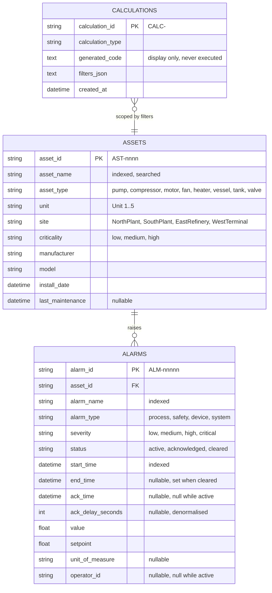

# Low-Level Design

**Multi-MCP Enterprise Operations Copilot**

Companion to [`hld.md`](hld.md). Where the HLD says *what the components are and why*,
this document says *exactly what they contain*: schemas, signatures, algorithms, state
machines, and error mappings.

## How this document is written

Each section is authored **immediately before the component it describes is built**, and
reconciled against the code in the final documentation pass. An LLD written in full
before its dependencies exist is fiction; one written afterwards is a transcript. This
sits between the two.

| § | Contents | Written during | Status |
|---|---|---|---|
| 1 | Data model | Step 2 — simulator | **Done** (1.4–1.5 pending) |
| 2 | API contracts | Steps 2, 8 | **2.1 done**, 2.2–2.3 pending |
| 3 | MCP tool contracts | Steps 3, 6 | Pending |
| 4 | Module specifications | Steps 3–9 | Pending |
| 5 | Algorithms | Steps 2, 5, 7 | **5.1–5.2, 5.7–5.8 done** |
| 6 | Sequence diagrams | Step 7 | Pending |
| 7 | State machines | Steps 4, 6, 7 | Pending |
| 8 | Error taxonomy | Step 3 | Pending |
| 9 | Configuration reference | Step 8 | Pending |
| 10 | Test matrix | Step 10 | Pending |

---

## 1. Data model

### 1.1 Entity relationships



### 1.2 Table notes

**`assets`** — `asset_id` is the natural key the collections chain into every
downstream request. Composite index `ix_assets_search` on `(asset_name, asset_type)`
because search matches both together.

**`alarms`** — two composite indexes matching the real access patterns:
`ix_alarms_asset_time` on `(asset_id, start_time)` for "alarms for this asset in this
window", and `ix_alarms_time_severity` on `(start_time, severity)` for the flood and
correlation scans that sweep a whole unit.

`ack_delay_seconds` is **denormalised** from `ack_time - start_time`. Acknowledgement
delay appears in three KPIs, two calculations, and the priority score; recomputing a
difference per row on every summary request is wasted work for a value that never
changes after acknowledgement.

**Invariants**, asserted in `tests/unit/test_simulator_seed.py`:

- `status = 'active'` ⟹ `ack_time IS NULL` and `ack_delay_seconds IS NULL` and
  `operator_id IS NULL`. An alarm cannot be simultaneously live and answered.
- `end_time IS NOT NULL` ⟹ `end_time > start_time`.
- Every `alarms.asset_id` resolves to a real asset.

**`calculations`** — append-only. `generated_code` is stored for display; execution
dispatches on `calculation_type` to a reviewed implementation.

### 1.3 Identifier schemes

| Entity | Format | Example | Rationale |
|---|---|---|---|
| Asset | `AST-` + 4-digit zero-padded sequence | `AST-0005` | Stable across runs for a fixed seed, so demo scripts and tests can name them |
| Alarm | `ALM-` + 5-digit zero-padded sequence | `ALM-00069` | Same |
| Calculation | `CALC-` + 12 hex characters | `CALC-7f8f0ea07384` | Created at runtime, so a random suffix avoids collisions without coordination |

Sequential rather than UUID for assets and alarms specifically because a fixed seed
must reproduce identical identifiers (NFR-05).

### 1.4 Retrieval index

_Pending — Step 5._

### 1.5 Trace and conversation store

_Pending — Step 8._

---

## 2. API contracts

### 2.1 Alarm Management API

Fully specified in **[`api-integration.md`](api-integration.md)** — endpoint
inventory, auth, trace headers, error envelope, enumerations, pagination semantics,
the contract-critical response paths, and the filters that appear only in the
chaining collection.

Kept there rather than duplicated here because it is the document a reader
integrating with the API will look for by name.

### 2.2 Copilot backend

_Pending — Step 8._

### 2.3 SSE event envelope

_Pending — Step 8._

---

## 3. MCP tool contracts

All 17 tools, each documented with the ten fields the submission guidelines mandate:
name, purpose, input schema, output schema, authentication behaviour, underlying
source-system operation, error behaviour, timeout behaviour, example invocation, example
response.

This section is the source of truth for the generated
[`mcp-tool-catalog.md`](mcp-tool-catalog.md).

_Pending — Steps 3 and 6._

---

## 4. Module specifications

Public classes, method signatures with types, invariants, async model, and dependency
direction.

- **4.1** `connectors/alarm_api`
- **4.2** `mcp-servers/alarm-management`
- **4.3** `apps/backend/copilot_backend/mcp_client`
- **4.4** `apps/backend/copilot_backend/llm`
- **4.5** `apps/backend/copilot_backend/orchestrator`
- **4.6** `rag/ingestion`
- **4.7** `apps/frontend` — component tree and props contracts

_Pending — Steps 3–9._

---

## 5. Algorithms

Implemented in `services/alarm-simulator/alarm_simulator/analytics.py`, kept pure so
each is unit-testable against a plain list of alarms with no HTTP or database.

### 5.1 Co-occurrence correlation

Answers "which alarms tend to fire together, and is that association real or chance?"

```
input:  alarms, lag_window_minutes, severity_threshold, min_support
eligible ← alarms with severity rank ≥ threshold
group eligible by asset_id                    # correlation is within one asset only
for each asset's alarms, sorted by start_time:
    for each alarm A at index i:
        for each later alarm B:
            if B.start - A.start > lag_window: break     # sorted, so stop early
            if A.name = B.name: continue                 # not self-correlation
            support[(A.name, B.name)] += 1
            lags[(A.name, B.name)].append(B.start - A.start)
for each pair with support ≥ min_support:
    confidence ← support / count(A.name)
    lift       ← confidence / (count(B.name) / total)
sort by (support, lift) descending
```

**Restricting to a single asset is the load-bearing decision.** Two alarms on unrelated
equipment happening to fire together is coincidence; counting it would swamp the real
findings with noise proportional to plant size.

`lift` is what separates a real association from a common alarm appearing everywhere:
a name that fires constantly will show high support against everything, but its lift
stays near 1.0. On the seeded estate the engineered pair reports support 31 with lift
2.29.

Complexity: O(n log n) sort plus O(n·k), where k is the number of alarms inside one
lag window. The `break` on the sorted scan is what keeps k small rather than n.

### 5.2 Rolling-window flood detection

Answers "when did alarms arrive faster than an operator could process them?"

```
input:  alarms, threshold_count, rolling_window_minutes
ordered ← alarms sorted by start_time
for each left index:
    extend right while ordered[right+1].start - ordered[left].start ≤ window
    if (right - left + 1) ≥ threshold_count: emit candidate(left..right)
merge candidates that overlap             # one burst yields one window
for each merged window:
    peak_rate ← alarm_count / max(span_minutes, 1)
    dominant_alarm_name ← most common name in the window
sort by alarm_count descending
```

**The merge step is what makes the output actionable.** Without it a 30-alarm burst
emits ~20 near-identical overlapping windows, which is a wall of noise rather than a
finding. Tested directly by `test_overlapping_detections_merge_into_one_burst`.

Complexity: O(n log n) sort, then O(n) with a two-pointer scan — `right` never moves
backwards across iterations.

### 5.3 Header-aware chunking

_Pending — Step 5._

### 5.4 Reciprocal rank fusion

_Pending — Step 5._

### 5.5 Citation construction and low-confidence thresholding

_Pending — Step 5._

### 5.6 Placeholder resolution grammar

_Pending — Step 7._

### 5.7 Priority scoring and KPI formulas

**Priority score** — weighted composite, 0–100:

| Factor | Weight | Normalisation | Saturates at |
|---|---:|---|---|
| Severity | 0.35 | rank ÷ 3 | `critical` |
| Asset criticality | 0.25 | low 0.0, medium 0.5, high 1.0 | `high` |
| Recurrence | 0.25 | occurrences ÷ 20 | 20 occurrences |
| Acknowledgement delay | 0.15 | seconds ÷ 3600 | 1 hour |

`score = Σ (normalised × weight) × 100`, banded `≥70 critical`, `≥50 high`,
`≥30 medium`, else `low`.

Each factor saturates so a single extreme value cannot dominate — an alarm that
recurred 500 times is not 25× more urgent than one that recurred 20 times.

**The factor breakdown is part of the response contract, not a debugging aid.** A bare
number is not actionable, and the copilot needs the components to explain a ranking
rather than invent a rationale. `test_contributions_sum_to_the_score` asserts the
breakdown reconciles.

**KPI formulas:**

| KPI | Formula | Note |
|---|---|---|
| `alarm_count` | `count(alarms)` | |
| `critical_count` | `count(severity = 'critical')` | |
| `avg_ack_delay` | `mean(ack_delay_seconds)` | Unacknowledged alarms are **excluded**, not counted as zero — including them would make a backlog look like fast response |
| `recurring_rate` | `(count − distinct names) / count` | 0.0 when every alarm is unique |
| `suppression_candidate_rate` | `count(alarms in names occurring ≥ 5) / count` | |

All divisions guard against an empty group; `test_kpis_on_empty_input_do_not_divide_by_zero`
covers it.

### 5.8 Deterministic seed generation

```
rng ← Random(seed)                        # fixed seed ⇒ identical ids (NFR-05)
build 30 assets from a fixed spec list    # names, units, sites are not random
plant engineered patterns:                # see api-integration.md §8
    BFP-101 recurring co-occurring pair    (30 pairs inside the lag window)
    flood bursts in NorthPlant Unit 2      (4 bursts of 16–26 inside 8 minutes)
    stale active alarms in Unit 1          (open 6–96 hours)
    active alarms at EastRefinery
    nuisance repetition in Unit 4
    bimodal ack delays across SouthPlant   (70% prompt, 30% very slow)
fill the remainder with background traffic to reach the target count
```

Timestamps anchor to the current date so "last 90 days" always returns data;
identifiers never move. That split is why NFR-05 promises reproducible **ids**
specifically rather than reproducible timestamps.

Bimodal acknowledgement delay matters: a single uniform distribution would make the
operator-efficiency KPI a constant, and the calculation would demonstrate nothing.

---

## 6. Sequence diagrams

Happy path; chained tool call with placeholder substitution; retrieval inside the same
workflow; tool timeout with retry then degraded answer; write-approval round trip;
ingestion pipeline; startup tool discovery.

_Pending — Step 7._

---

## 7. State machines

- **7.1** Step lifecycle — `pending → resolving → validating → invoking → retrying →
  succeeded | failed | skipped`
- **7.2** Conversation and session
- **7.3** Write-approval gate

_Pending — Steps 4, 6, 7._

---

## 8. Error taxonomy

Every failure crossing a boundary is classified once and carried unchanged from there.

| Source condition | HTTP | Connector exception | MCP `error_code` | Retried? | Orchestrator response |
|---|---:|---|---|:---:|---|
| Missing / malformed / wrong bearer token | 401 | `AlarmApiAuthError` | `AUTH_FAILED` | No | Abort the run; this is configuration, not data |
| Unknown asset, alarm, or calculation | 404 | `AlarmApiNotFound` | `NOT_FOUND` | No | Mark the step failed; continue independent steps |
| Failed validation upstream | 400 / 422 | `AlarmApiInvalidInput` | `INVALID_INPUT` | No | Mark failed; do not re-issue the same arguments |
| Source system fault | 5xx | `AlarmApiUpstreamError` | `UPSTREAM_5XX` | **Yes**, ×2 | Degrade the step; state the gap in the answer |
| Deadline exceeded / connection refused | — | `AlarmApiTimeout` | `TIMEOUT` | **Yes**, ×2 | Degrade the step; state the gap in the answer |
| Defect in the MCP server itself | — | — | `INTERNAL_ERROR` | No | Mark failed; do not blame the source system |

### 8.1 Why the retry column is split this way

Retrying is only correct when a retry could plausibly succeed. A 400 will fail
identically on the second attempt, so retrying spends the caller's deadline to reach
the same answer. A 401 is worse: retrying converts an obvious configuration error into
a slow one. Only 5xx and connection failures are transient, so only they are retried —
twice, with exponential backoff from 0.25 s.

`test_does_not_retry_a_400`, `test_does_not_retry_a_401`, and
`test_does_not_retry_a_404` assert the negative cases directly, because a too-eager
retry policy fails silently rather than loudly.

### 8.2 How the code survives the boundary

The MCP SDK wraps whatever a tool raises in its own `ToolError`, discarding custom
attributes. So the contract is carried **in the message**, as a machine-readable
prefix:

```
[TIMEOUT] ConnectTimeout contacting the Alarm Management API (trace_id=trace-abc123)
```

`parse_error_code()` recovers `("TIMEOUT", "ConnectTimeout contacting…")` on the client
side. An unrecognised or absent prefix classifies as `INTERNAL_ERROR` rather than
raising, so an unexpected failure is still handled rather than crashing the caller.

This is why the orchestrator can branch on *why* a step failed without matching prose —
and why rewording a message cannot break error handling.

### 8.3 Secret redaction

Structured logging applies redaction as a **processor**, not at each call site:
anything matching a bearer token, an `sk-ant-` key, or a `ghp_` token is replaced
before a record renders, and any field named `token`, `api_key`, `authorization`,
`password`, or `secret` is masked wholesale. "Remember not to log the token" is not a
control; a processor is.

`test_token_never_appears_in_an_exception` covers the highest-risk path, since an
exception is the thing most likely to reach a log or a user.

---

## 9. Configuration reference

Every environment variable: name, type, default, required, consuming service, whether it
is a secret, and the effect when it is absent. Cross-checked against `.env.example`.

_Pending — Step 8._

---

## 10. Test matrix

Test ID → category → target module → precondition → assertion → the `FR-xx` it covers.
Feeds the traceability matrix in [`hld.md`](hld.md#12-traceability-matrix).

_Pending — Step 10._
