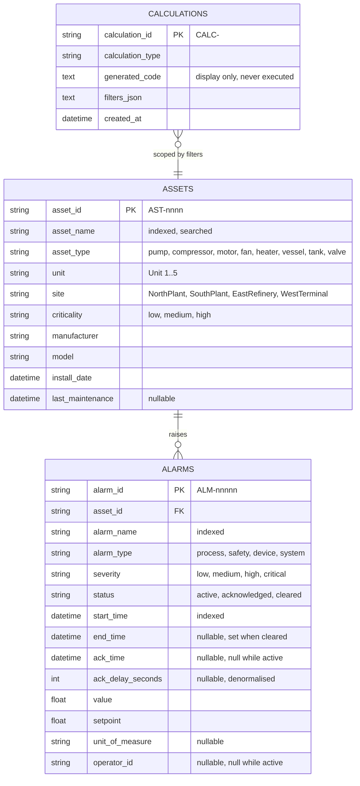
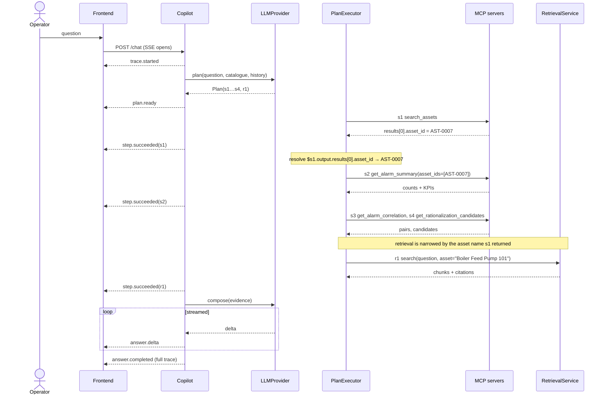
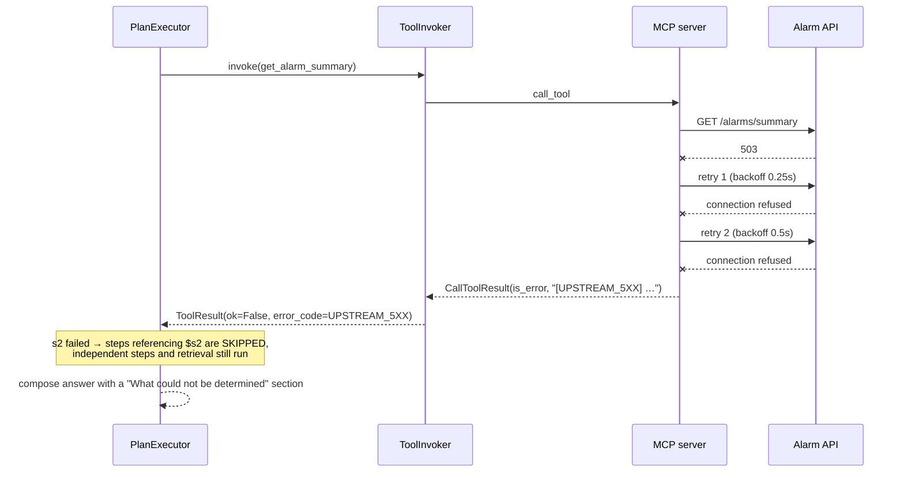
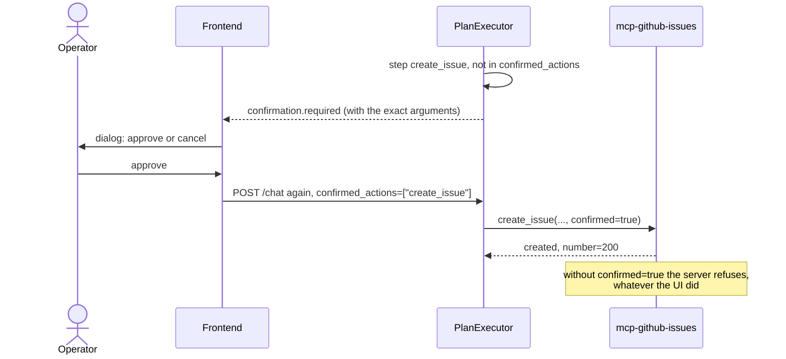
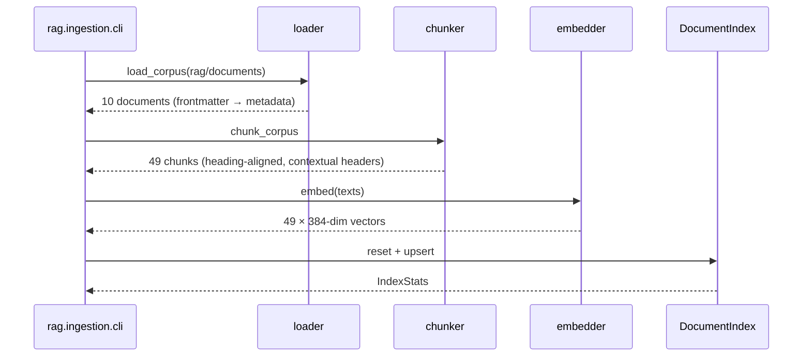
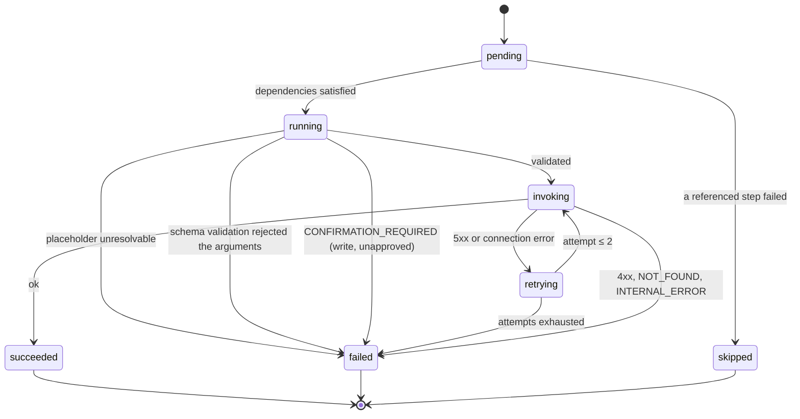
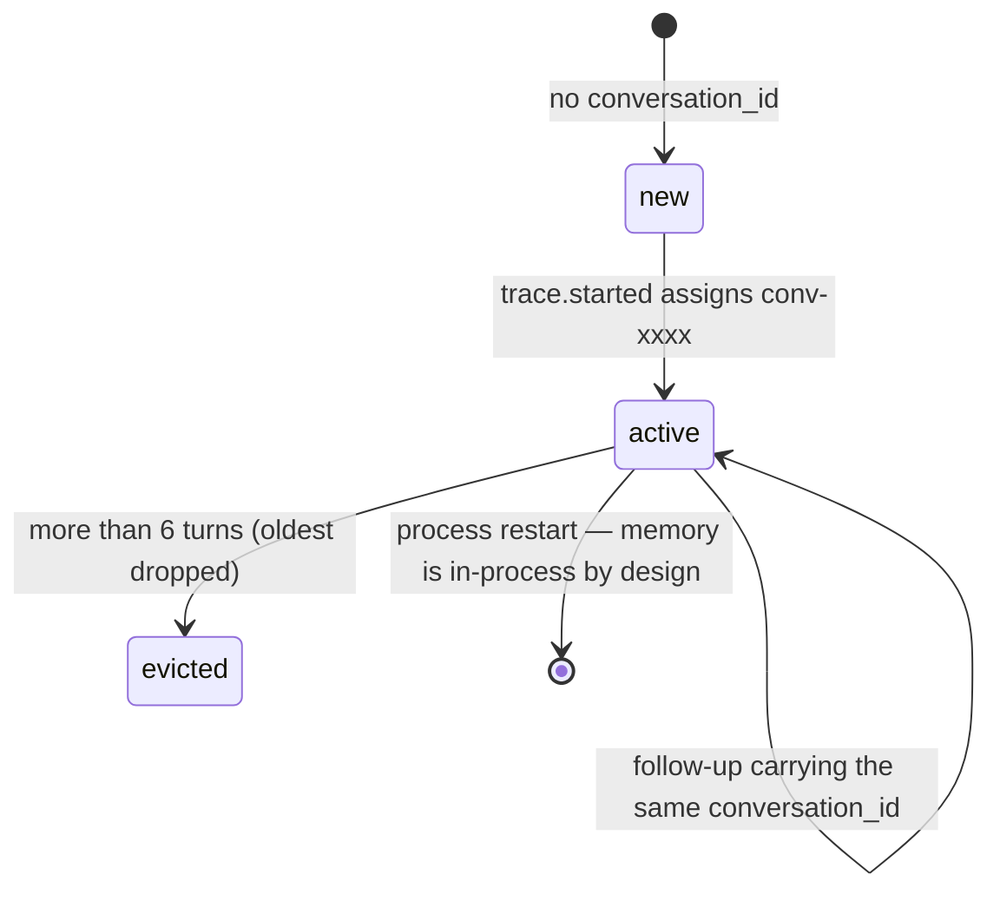
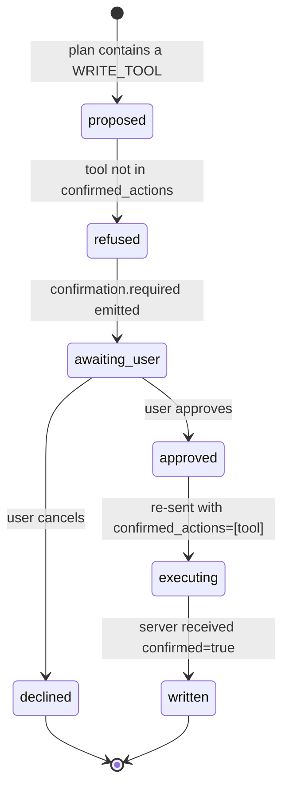

# Low-Level Design

**Multi-MCP Enterprise Operations Copilot**

Companion to [`hld.md`](hld.md). Where the HLD says *what the components are and why*,
this document says *exactly what they contain*: schemas, signatures, algorithms, state
machines, and error mappings.

## How this document is written

Each section is authored **immediately before the component it describes is built**, and
reconciled against the code in the final documentation pass. An LLD written in full
before its dependencies exist is fiction; one written afterwards is a transcript. This
sits between the two.

| § | Contents | Written during | Status |
|---|---|---|---|
| 1 | Data model | Step 2 — simulator | Done |
| 2 | API contracts | Steps 2, 8 | Done |
| 3 | MCP tool contracts | Steps 3, 6 | Done — generated, see §3 |
| 4 | Module specifications | Steps 3–9 | Done |
| 5 | Algorithms | Steps 2, 5, 7 | Done |
| 6 | Sequence diagrams | Step 7 | Done |
| 7 | State machines | Steps 4, 6, 7 | Done |
| 8 | Error taxonomy | Step 3 | Done |
| 9 | Configuration reference | Step 8 | Done |
| 10 | Test matrix | Step 10 | Done |

All sections have been reconciled against the code as built. Where the implementation
diverged from the design, **the document was corrected rather than the divergence
excused**; each such case is called out in place.

---

## 1. Data model

### 1.1 Entity relationships



### 1.2 Table notes

**`assets`** — `asset_id` is the natural key the collections chain into every
downstream request. Composite index `ix_assets_search` on `(asset_name, asset_type)`
because search matches both together.

**`alarms`** — two composite indexes matching the real access patterns:
`ix_alarms_asset_time` on `(asset_id, start_time)` for "alarms for this asset in this
window", and `ix_alarms_time_severity` on `(start_time, severity)` for the flood and
correlation scans that sweep a whole unit.

`ack_delay_seconds` is **denormalised** from `ack_time - start_time`. Acknowledgement
delay appears in three KPIs, two calculations, and the priority score; recomputing a
difference per row on every summary request is wasted work for a value that never
changes after acknowledgement.

**Invariants**, asserted in `tests/unit/test_simulator_seed.py`:

- `status = 'active'` ⟹ `ack_time IS NULL` and `ack_delay_seconds IS NULL` and
  `operator_id IS NULL`. An alarm cannot be simultaneously live and answered.
- `end_time IS NOT NULL` ⟹ `end_time > start_time`.
- Every `alarms.asset_id` resolves to a real asset.

**`calculations`** — append-only. `generated_code` is stored for display; execution
dispatches on `calculation_type` to a reviewed implementation.

### 1.3 Identifier schemes

| Entity | Format | Example | Rationale |
|---|---|---|---|
| Asset | `AST-` + 4-digit zero-padded sequence | `AST-0005` | Stable across runs for a fixed seed, so demo scripts and tests can name them |
| Alarm | `ALM-` + 5-digit zero-padded sequence | `ALM-00069` | Same |
| Calculation | `CALC-` + 12 hex characters | `CALC-7f8f0ea07384` | Created at runtime, so a random suffix avoids collisions without coordination |

Sequential rather than UUID for assets and alarms specifically because a fixed seed
must reproduce identical identifiers (NFR-05).

### 1.4 Retrieval index

Chroma collection `operations-docs`, persisted at `CHROMA_PATH`, distance
`hnsw:space = cosine` over L2-normalised vectors so the raw score is directly readable
as similarity. One record per chunk:

| Field | Type | Meaning |
|---|---|---|
| `id` | string | `<doc_id>#<section-anchor>:<part>` — stable, so re-ingestion upserts rather than duplicates |
| `document` | text | The chunk body, **prefixed with `"<title> — <section>"`** (§5.3) |
| `embedding` | float[384] | From the configured embedder |
| `doc_id`, `title`, `doc_type` | string | Citation and type filtering |
| `section`, `section_anchor`, `citation` | string | Citation precision |
| `asset_tags` | string | Delimiter-wrapped: `\|Boiler Feed Pump 101\|…\|` (§7.3) |
| `unit`, `site` | string | Scope filtering |
| `last_reviewed`, `version` | string | Shown so an operator can judge currency |
| `source_path` | string | Traceability back to the file on disk |

Metadata values are scalars only — Chroma rejects lists — which is why `asset_tags` is a
delimited string rather than an array.

The BM25 index is **not** persisted. It is rebuilt lazily from the stored chunks on the
first query of a process and cached for its lifetime; at 49 chunks the build costs
single-digit milliseconds, and persisting it would add a second artefact to keep in sync
with the first.

### 1.5 Trace and conversation store

Both in-process and bounded. Persisting them is not a requirement, and an unbounded
store in a long-running demo is a slow memory leak.

**`ExecutionTrace`** — one per request, keyed by `request_id`, served by
`GET /traces/{request_id}`:

| Field | Type | Notes |
|---|---|---|
| `request_id`, `conversation_id`, `trace_id` | string | `req-`, `conv-`, `trace-` + 12 hex |
| `question`, `intent`, `answer` | string | |
| `steps` | `list[StepRecord]` | The timeline, in execution order |
| `citations` | `list[dict]` | Structured form of every `[source: …]` marker |
| `gaps` | `list[str]` | What the plan could not cover |
| `low_confidence` | bool | Retrieval below threshold |
| `llm_latency_ms`, `planner_provider` | float, string | |

**`StepRecord`** carries `id`, `kind`, `label`, `status`, `server`, `tool`, `arguments`,
`output`, `error_code`, `error_message`, `duration_ms`, `trace_id`, `reason`. One model
feeds the SSE stream, the trace endpoint, and the structured logs, so observability and
GUI traceability cannot drift apart (ADR-06).

**`ConversationMemory`** — `dict[conversation_id, deque[Turn]]` with `maxlen = 6`. Only
the last 3 turns reach the planner, with answers truncated to 200 characters: the planner
needs to resolve "it" and "that pump", not to re-read previous answers.

---

## 2. API contracts

### 2.1 Alarm Management API

Fully specified in **[`api-integration.md`](api-integration.md)** — endpoint
inventory, auth, trace headers, error envelope, enumerations, pagination semantics,
the contract-critical response paths, and the filters that appear only in the
chaining collection.

Kept there rather than duplicated here because it is the document a reader
integrating with the API will look for by name.

### 2.2 Copilot backend

Six endpoints. Implementation: `apps/backend/copilot_backend/api/app.py`.

| Method | Path | Request | Response | Errors |
|---|---|---|---|---|
| `GET` | `/health` | — | `{status: "ok"\|"degraded", version, tools, servers[]}` | Never fails; `degraded` when no MCP server is connected |
| `GET` | `/mcp/servers` | — | `{servers: [{name, connected, tool_count, error}]}` | — |
| `GET` | `/mcp/tools` | — | `{tools: [{server, name, qualified_name, description, input_schema, output_schema}]}` | — |
| `POST` | `/chat` | `{question: str(1..2000), conversation_id?, confirmed_actions: str[]}` | `text/event-stream` (§2.3) | 422 on validation; stream errors arrive as an `error` event, never as a broken connection |
| `GET` | `/traces/{request_id}` | — | The full `ExecutionTrace` (§1.5) | 404 when unknown |
| `POST` | `/actions/confirm` | `{request_id, tool, approved}` | `{request_id, tool, approved, next}` | — |

`confirmed_actions` is **per request**. `/actions/confirm` records a decision and tells
the caller to re-send the question with the tool listed; it does not grant a standing
permission. A sticky grant would let one approval authorise writes the user never saw —
asserted by `test_approval_does_not_persist_into_the_next_request`.

`GET /health` returning 200 while degraded is deliberate: the container is alive and can
explain what is wrong, which is more useful to an operator than a failing healthcheck
that takes the service out of the topology.

### 2.3 SSE event envelope

Every frame is `event: <name>` plus one `data:` line of JSON. Frames are separated by a
blank line and the server emits CRLF, which both the browser client and the test parser
normalise before splitting — a parser that splits only on `\n\n` merges the entire stream
into one unparseable frame.

| Event | Payload | When |
|---|---|---|
| `trace.started` | `{request_id, conversation_id, trace_id, question, provider}` | Immediately, so the GUI can show a trace id even if planning fails |
| `plan.ready` | `{intent, gaps[], steps: [{id, kind, tool, reason, args}]}` | After planning and registry validation |
| `step.started` | `StepRecord.to_event()` with `status: "running"` | Per step |
| `step.succeeded` | `…` with `status: "succeeded"`, `output`, `duration_ms` | Per step |
| `step.failed` | `…` with `status: "failed"\|"skipped"`, `error_code`, `error_message` | Per step |
| `confirmation.required` | `…` with `error_code: "CONFIRMATION_REQUIRED"` | A write step with no approval |
| `answer.delta` | `{text}` | Repeatedly, as the answer composes |
| `answer.completed` | The full `ExecutionTrace` dict | Last frame, always |
| `error` | `{error_code, message}` | Planning or composition failed; the stream still closes cleanly with `answer.completed` |

Two invariants the GUI depends on: `answer.completed` is always the final frame even on
failure, and step events for one step id arrive in status order, so the client can
replace by id rather than accumulate duplicates.

---

## 3. MCP tool contracts

All 17 tools, each with the ten fields the submission guidelines mandate — name, purpose,
input schema, output schema, authentication behaviour, underlying source-system
operation, error behaviour, timeout behaviour, example invocation, example response —
live in **[`mcp-tool-catalog.md`](mcp-tool-catalog.md)**.

**That document is generated, and this one is not the source of truth for it.** The
original plan had it the other way round: this section would be written first and the
catalog generated from it. That was wrong. A hand-written contract and a running server
drift the first time a parameter changes, and the reader has no way to tell which is
lying. `scripts/gen_tool_catalog.py` instead calls `list_tools()` against both live
servers, captures **real** example responses by invoking each tool against the seeded
simulator, and writes the file. CI runs it with `--check`, so a schema change without a
regenerated catalog fails the build.

What stays here is the part that is a *design* statement rather than a transcript:

### 3.1 Contract rules every tool obeys

| Rule | Enforcement |
|---|---|
| **No tool accepts a credential.** Not the bearer token, not an API key, not a header override. | The parameter does not exist. A model driving these tools has no code path to the secret. |
| Every tool accepts an optional `trace_id`, generates one when absent, forwards it upstream, and returns it in `meta.trace_id`. | `_trace()` / `_meta()` in `alarm_mcp/server.py` |
| Descriptions are written **for a model to read**, not for a human browsing docs. | They are the planner's only basis for tool selection; a vague one produces a wrong plan no downstream validation can repair. |
| Errors surface as `[CODE] message` with a stable code. | `tool_errors` decorator, §8.2 |
| Read tools are side-effect free; the one write tool refuses without explicit approval. | `create_issue(confirmed: bool = False)` |

### 3.2 Tool inventory

| Server | Tools |
|---|---|
| `alarm-management` | `search_assets`, `get_asset_metadata`, `get_alarms`, `get_alarm_by_id`, `get_alarm_summary`, `get_alarm_trends`, `get_alarm_correlation`, `get_flood_analysis`, `get_rationalization_candidates`, `get_priority_score`, `get_operator_recommendations`, `generate_calculation`, `execute_calculation`, `get_kpi_definitions` |
| `github-issues` | `search_issues`, `draft_issue`, `create_issue` |

The split between `draft_issue` (pure, writes nothing) and `create_issue` (gated) is
deliberate: it lets the copilot show a user exactly what would be written before anything
is, which is the only way a confirmation dialog can be informed rather than ceremonial.

---

## 4. Module specifications

Public surface, invariants, and dependency direction per package. Dependencies point one
way throughout: `frontend → backend → mcp_client → (MCP protocol) → mcp servers →
connector → simulator`, with `rag` a leaf the backend depends on and nothing depends back
into.

### 4.1 `connectors/alarm_api`

```python
class AlarmApiClient:
    def __init__(self, base_url: str, token: str, *, timeout_seconds: float = 5.0,
                 max_retries: int = 2, client_id: str = "copilot",
                 transport: httpx.AsyncBaseTransport | None = None) -> None
    async def search_assets(self, query: str, *, limit: int = 10,
                            unit: str | None = None, trace_id: str | None = None) -> dict
    # …one method per endpoint, all returning the decoded payload
    async def aclose(self) -> None
```

**Invariants.** The token is never a public attribute, never a method parameter, and
never appears in an exception message. `transport` exists so tests can mount the
simulator's ASGI app directly — the injection point that makes "integration test without
a socket" possible. Retries apply to `RETRYABLE_STATUS = {500, 502, 503, 504}` and
connection errors only.

Separate from the MCP server on purpose: a reusable connector is a scored criterion, and
folding HTTP concerns into tool definitions would make both harder to test.

### 4.2 `mcp-servers/*`

```python
mcp = MCPServer(name="alarm-management", version="1.0.0", instructions=...)

@mcp.tool()
@tool_errors("search_assets")
async def search_assets(query: Annotated[str, Field(description=...)], ...) -> SearchAssetsOutput
```

`tool_errors` is the single place where connector exceptions become the `[CODE] message`
contract, so no tool body contains error-handling boilerplate and none can forget it.
`get_client()` / `set_client()` hold one connector per process for connection pooling,
and give tests an injection seam.

### 4.3 `mcp_client`

```python
@dataclass(frozen=True)
class ToolSpec:      server, name, qualified_name, description, input_schema, output_schema

class ToolRegistry:                      # async context manager
    async def __aenter__(self) -> ToolRegistry     # connects, list_tools(), caches
    def specs(self) -> list[ToolSpec]
    def get(self, name: str) -> ToolSpec           # raises ToolNotFoundError, listing alternatives
    def server_status(self) -> list[ServerStatus]
    def catalogue_for_planner(self) -> list[dict]  # sorted, no output schemas
    @property tool_count: int

class ToolInvoker:
    def validate(self, name: str, args: dict) -> None      # jsonschema, all violations at once
    async def invoke(self, name, args, *, trace_id=None) -> ToolResult
```

**Why the registry is an async context manager.** The MCP `Client` holds an anyio task
group that must be entered and exited from the *same* task. A yielding pytest fixture
tears down in a different task, which fails with "cancel scope in a different task". The
context manager makes the constraint structural rather than a comment.

**`ToolResult` is uniform on success and failure** — `ok`, `output`, `error_code`,
`error_message`, `duration_ms`, `trace_id`, `server`, `tool`, `arguments`, `retry_count`.
One envelope feeds the timeline, the logs, and the composer.

> **Correction found by a test.** `Client.call_tool()` returns
> `CallToolResult(is_error=True)` rather than raising, so an early version treated
> "no exception" as success and reported failed tool calls as successes with
> `output=None`. The invoker now checks `is_error` explicitly, and
> `test_a_tool_failure_is_reported_as_a_failure` exists to keep it that way.

### 4.4 `llm`

```python
@runtime_checkable
class LLMProvider(Protocol):
    @property def name(self) -> str
    async def plan(self, question, catalogue, *, history="") -> Plan
    def compose(self, question, evidence, *, low_confidence, items=None) -> AsyncIterator[str]
```

Two real implementations: `AnthropicProvider` (schema-constrained `messages.parse`,
cached system block, streamed composition, `stop_reason` checked centrally) and
`RuleBasedProvider` (intent classification, slot extraction, capability templates,
deterministic composition). Two implementations rather than one prove the abstraction;
the second also means the system runs with no credentials.

No vendor SDK is imported anywhere else in the backend.

### 4.5 `orchestrator`

| Module | Public surface | Invariant |
|---|---|---|
| `models` | `Plan`, `PlanStep`, `StepRecord`, `ExecutionTrace`, `StepStatus` | Pydantic for the LLM-facing types, dataclasses for internal records |
| `resolver` | `resolve_args`, `referenced_steps`, `PlaceholderError` | Unresolvable references raise; they never become `None` |
| `executor` | `PlanExecutor.run(plan, trace) -> AsyncIterator[(event, payload)]` | A step whose dependency failed is **skipped**, not attempted |
| `composer` | `AnswerComposer.compose(trace, outcome)` | Verifies every emitted citation against what was retrieved |
| `memory` | `ConversationMemory` | Bounded (§1.5) |
| `pipeline` | `Copilot.ask(question, *, conversation_id, confirmed_actions)` | Yields `(event, payload)`; never raises into the stream |

`WRITE_TOOLS = {"create_issue": "confirmed"}` maps a gated tool to the argument that
carries approval. Keyed explicitly rather than inferred from the schema, so adding a
write tool is a deliberate act rather than an accident of naming.

### 4.6 `rag`

```python
# ingestion
load_corpus(dir) -> list[LoadedDocument]
chunk_corpus(docs, *, max_tokens=500, overlap_tokens=50) -> list[(LoadedDocument, Chunk)]
build_embedder(name) -> Embedder                 # "hashing" | a sentence-transformers id
build_index(docs, pairs, embedder, *, persist_path, collection_name, reset) -> IndexStats
class DocumentIndex:  query(vector, top_k), all_chunks(), count, reset()

# retrieval
class RetrievalService:  search(query, *, asset=None, doc_type=None, top_k=None) -> RetrievalResult
build_citations(result) -> list[Citation]
verify_citations(answer, citations) -> (valid, hallucinated)
scan(text) -> GuardReport ;  wrap_for_prompt(chunks) -> str
```

`Embedder` is a protocol; swapping the embedder is a constructor argument, and swapping
the vector store is a change to `indexer.py` alone.

### 4.7 `apps/frontend`

```
App
├─ header ─ ServerStatus pills          ← GET /mcp/servers
├─ Chat
│   ├─ AnswerText  { text, citations: Map<string, Citation>, onCite }
│   └─ composer    (Ctrl/Cmd+Enter to send)
├─ Side panel (tabs)
│   ├─ Timeline    { steps: StepEvent[], plan, busy, expanded, onExpand }
│   ├─ Evidence    { citations: Citation[], busy }
│   └─ Discovery   { tools: ToolSpec[], error, expanded, onExpand }
└─ ConfirmDialog   { step, onApprove, onCancel }
```

Every panel has explicit loading, empty, and error states. `api.ts` reads the SSE stream
with `fetch` + `response.body.getReader()` rather than `EventSource`, because
`EventSource` can only issue GETs and the question belongs in a body, not a query string.

**`dangerouslySetInnerHTML` appears nowhere.** The answer contains model output and
retrieved document content, both untrusted; citation markers are parsed out with a regex
and rendered as elements, and everything else is text.

---

## 5. Algorithms

Implemented in `services/alarm-simulator/alarm_simulator/analytics.py`, kept pure so
each is unit-testable against a plain list of alarms with no HTTP or database.

### 5.1 Co-occurrence correlation

Answers "which alarms tend to fire together, and is that association real or chance?"

```
input:  alarms, lag_window_minutes, severity_threshold, min_support
eligible ← alarms with severity rank ≥ threshold
group eligible by asset_id                    # correlation is within one asset only
for each asset's alarms, sorted by start_time:
    for each alarm A at index i:
        for each later alarm B:
            if B.start - A.start > lag_window: break     # sorted, so stop early
            if A.name = B.name: continue                 # not self-correlation
            support[(A.name, B.name)] += 1
            lags[(A.name, B.name)].append(B.start - A.start)
for each pair with support ≥ min_support:
    confidence ← support / count(A.name)
    lift       ← confidence / (count(B.name) / total)
sort by (support, lift) descending
```

**Restricting to a single asset is the load-bearing decision.** Two alarms on unrelated
equipment happening to fire together is coincidence; counting it would swamp the real
findings with noise proportional to plant size.

`lift` is what separates a real association from a common alarm appearing everywhere:
a name that fires constantly will show high support against everything, but its lift
stays near 1.0. On the seeded estate the engineered pair reports support 31 with lift
2.29.

Complexity: O(n log n) sort plus O(n·k), where k is the number of alarms inside one
lag window. The `break` on the sorted scan is what keeps k small rather than n.

### 5.2 Rolling-window flood detection

Answers "when did alarms arrive faster than an operator could process them?"

```
input:  alarms, threshold_count, rolling_window_minutes
ordered ← alarms sorted by start_time
for each left index:
    extend right while ordered[right+1].start - ordered[left].start ≤ window
    if (right - left + 1) ≥ threshold_count: emit candidate(left..right)
merge candidates that overlap             # one burst yields one window
for each merged window:
    peak_rate ← alarm_count / max(span_minutes, 1)
    dominant_alarm_name ← most common name in the window
sort by alarm_count descending
```

**The merge step is what makes the output actionable.** Without it a 30-alarm burst
emits ~20 near-identical overlapping windows, which is a wall of noise rather than a
finding. Tested directly by `test_overlapping_detections_merge_into_one_burst`.

Complexity: O(n log n) sort, then O(n) with a two-pointer scan — `right` never moves
backwards across iterations.

### 5.3 Header-aware chunking

```
input: document (frontmatter + markdown body), max_tokens = 500, overlap = 50
sections ← split body on ^#{1,6} headings
for each (heading, body):
    if heading is boilerplate: skip            # "Related documents", "References", …
    if estimate_tokens(body) ≤ max_tokens:
        emit chunk(text = f"{title} — {heading}\n\n{body}")
    else:
        split body on blank lines into paragraphs
        pack paragraphs greedily up to max_tokens, carrying `overlap` tokens forward
        emit each part with the same contextual header, part index in the chunk id
```

Two decisions that were each found by a failing retrieval, not by planning:

**Boilerplate exclusion.** Navigation sections are short and dense with *other*
documents' titles, so they match almost any query while containing no answer. A "Related
documents" list outranked the actual procedure for its own topic. Dropping them at
ingestion is more honest than down-weighting at query time — they are genuinely not
retrievable content.

**Contextual headers.** A document was unfindable by its own name: the title lived in
frontmatter and no chunk body contained the word "lockout". Prefixing each chunk with
`"<title> — <section>"` costs ~10 tokens and fixes the whole class.

Complexity: O(n) in document length. Estimation is words × 1.3 rather than a real
tokeniser — chunk size only has to be roughly right, and the dependency is not worth it.

### 5.4 Reciprocal rank fusion

```
input: query, top_k, optional asset/doc_type filters
vector_hits  ← index.query(embed(query), top_k × 4)   filtered by metadata
lexical_hits ← bm25.get_scores(tokenize(query))       top (top_k × 4), score > 0, filtered
fused ← {}
for rank, hit in enumerate(vector_hits,  1): fused[hit] += 1 / (RRF_K + rank)
for rank, hit in enumerate(lexical_hits, 1): fused[hit] += 1 / (RRF_K + rank)
ordered ← top_k of fused, descending
score      ← fused / (2 / (RRF_K + 1))               # scaled position, 0..1
similarity ← max(cosine, term_coverage(query, text)) # absolute relevance
```

`RRF_K = 60`, the standard constant, damping the top ranks so one system cannot dominate
the fusion alone.

**Why rank fusion and not a weighted score sum.** BM25 is unbounded and
corpus-dependent; cosine is bounded. Summing them silently weights one by whatever its
scale happens to be, and the weight would need re-tuning per corpus. Rank is comparable
by construction.

**Why over-fetch ×4.** Metadata filtering happens after retrieval, so fetching exactly
`top_k` would leave fewer than `top_k` survivors whenever a filter is active.

Complexity: O(N) for BM25 scoring over N chunks plus the index's ANN query, then
O(M log M) over the M ≈ 40 candidates.

### 5.5 Citation construction and low-confidence thresholding

Each chunk carries `citation = "<doc_id>#<section-anchor>"`, emitted inline as
`[source: OP-BFP-101#abnormal-condition-discharge-pressure-low]` and rendered in the
evidence panel with title, section, score, excerpt, and a `suspicious` flag from the
injection guard.

After composition, `verify_citations(answer, citations)` extracts every marker and
partitions it into valid and hallucinated. Hallucinated markers are counted into the
`hallucinated_citations` log field and rendered in amber by the GUI rather than silently
accepted — an unsupported claim that *looks* sourced is worse than an unsourced one.

**Thresholding uses absolute relevance, never the fused score:**

```
union            ← concatenation of the returned chunk texts
best_relevance   ← max(term_coverage(query, union), max(chunk.similarity))
low_confidence   ← best_relevance < RETRIEVAL_MIN_SCORE          # default 0.35
```

Three corrections are baked into those two lines, each from a real failure:

1. **Not the RRF score.** Its top entry is always near the maximum whether or not
   anything relevant was found; an entirely off-corpus query scored 0.98, which made the
   low-confidence path unreachable.
2. **Not cosine alone.** Over a lexical embedding it is compressed — a relevant passage
   scored 0.26 and an irrelevant one 0.27. No threshold separates those.
3. **Coverage over the union, not the best chunk.** A real operator question spreads its
   terms across several passages by design; scoring against one paragraph made a good
   retrieval look like a failure.

### 5.6 Placeholder resolution grammar

```
placeholder := "$" step_id ".output" path
path        := ( "." key | "[" index "]" )*
```

Example: `$s1.output.results[0].asset_id`. Resolution walks the earlier step's recorded
output, substituting recursively inside nested dicts and lists so a reference can appear
anywhere in an argument tree, not only at the top level.

**Every failure mode raises `PlaceholderError` with a diagnosis, never returns `None`:**

| Condition | Message contains |
|---|---|
| Step has not run | the reference, plus which steps *did* complete |
| Key missing | the key, plus the keys that are available |
| Index out of range | the index, plus how many items the earlier step returned |
| Indexing a non-list | what type was found instead |

A step that quietly runs with a missing argument produces a plausible-looking wrong
answer, which is strictly worse than a visible failure. `referenced_steps()` reads the
same grammar to compute dependencies, which is how the executor knows to *skip* a step
whose input never arrived rather than attempt it.

### 5.7 Priority scoring and KPI formulas

**Priority score** — weighted composite, 0–100:

| Factor | Weight | Normalisation | Saturates at |
|---|---:|---|---|
| Severity | 0.35 | rank ÷ 3 | `critical` |
| Asset criticality | 0.25 | low 0.0, medium 0.5, high 1.0 | `high` |
| Recurrence | 0.25 | occurrences ÷ 20 | 20 occurrences |
| Acknowledgement delay | 0.15 | seconds ÷ 3600 | 1 hour |

`score = Σ (normalised × weight) × 100`, banded `≥70 critical`, `≥50 high`,
`≥30 medium`, else `low`.

Each factor saturates so a single extreme value cannot dominate — an alarm that
recurred 500 times is not 25× more urgent than one that recurred 20 times.

**The factor breakdown is part of the response contract, not a debugging aid.** A bare
number is not actionable, and the copilot needs the components to explain a ranking
rather than invent a rationale. `test_contributions_sum_to_the_score` asserts the
breakdown reconciles.

**KPI formulas:**

| KPI | Formula | Note |
|---|---|---|
| `alarm_count` | `count(alarms)` | |
| `critical_count` | `count(severity = 'critical')` | |
| `avg_ack_delay` | `mean(ack_delay_seconds)` | Unacknowledged alarms are **excluded**, not counted as zero — including them would make a backlog look like fast response |
| `recurring_rate` | `(count − distinct names) / count` | 0.0 when every alarm is unique |
| `suppression_candidate_rate` | `count(alarms in names occurring ≥ 5) / count` | |

All divisions guard against an empty group; `test_kpis_on_empty_input_do_not_divide_by_zero`
covers it.

### 5.8 Deterministic seed generation

```
rng ← Random(seed)                        # fixed seed ⇒ identical ids (NFR-05)
build 30 assets from a fixed spec list    # names, units, sites are not random
plant engineered patterns:                # see api-integration.md §8
    BFP-101 recurring co-occurring pair    (30 pairs inside the lag window)
    flood bursts in NorthPlant Unit 2      (4 bursts of 16–26 inside 8 minutes)
    stale active alarms in Unit 1          (open 6–96 hours)
    active alarms at EastRefinery
    nuisance repetition in Unit 4
    bimodal ack delays across SouthPlant   (70% prompt, 30% very slow)
fill the remainder with background traffic to reach the target count
```

Timestamps anchor to the current date so "last 90 days" always returns data;
identifiers never move. That split is why NFR-05 promises reproducible **ids**
specifically rather than reproducible timestamps.

Bimodal acknowledgement delay matters: a single uniform distribution would make the
operator-efficiency KPI a constant, and the calculation would demonstrate nothing.

---

## 6. Sequence diagrams

### 6.1 Startup tool discovery

```mermaid
sequenceDiagram
    participant B as backend (lifespan)
    participant R as ToolRegistry
    participant M1 as mcp-alarm-management
    participant M2 as mcp-github-issues

    B->>R: async with ToolRegistry(servers)
    R->>M1: connect + list_tools()
    M1-->>R: 14 ToolSpec
    R->>M2: connect + list_tools()
    M2-->>R: 3 ToolSpec
    Note over R: one cache serves the planner,<br/>the GUI, and argument validation
    R-->>B: ready (17 tools)
    Note over R,M2: a server that fails to connect is marked<br/>degraded; the rest stay usable
```

### 6.2 Happy path with chaining and retrieval in one workflow



### 6.3 Tool failure, retry, and a degraded answer



### 6.4 Write-approval round trip



### 6.5 Ingestion



---

## 7. State machines

### 7.1 Step lifecycle



`retrying` lives inside the MCP server, not the orchestrator: the connector owns the
retry policy because it is the only layer that knows the HTTP status. The orchestrator
sees one `ToolResult` with a `retry_count`.

**`skipped` is distinct from `failed` on purpose.** A step whose input never arrived was
never attempted, and reporting it as a failure would imply the tool was called and
misbehaved. The distinction is what lets the answer say "this could not be determined
because an earlier step failed" rather than inventing a cause.

### 7.2 Conversation and request



Each request inside a conversation gets a fresh `request_id` and `trace_id`; only
`conversation_id` persists. That is what makes a trace addressable after the fact while
follow-ups still resolve "it".

### 7.3 Write-approval gate



The gate exists in **two** places and the second is the one that matters: the
orchestrator refuses so the user gets an actionable prompt, and the MCP server refuses so
that any other caller — the model, a script, anything bypassing the GUI — is refused
identically. Approval is scoped to one request; it never becomes standing permission.

---

## 8. Error taxonomy

Every failure crossing a boundary is classified once and carried unchanged from there.

| Source condition | HTTP | Connector exception | MCP `error_code` | Retried? | Orchestrator response |
|---|---:|---|---|:---:|---|
| Missing / malformed / wrong bearer token | 401 | `AlarmApiAuthError` | `AUTH_FAILED` | No | Abort the run; this is configuration, not data |
| Unknown asset, alarm, or calculation | 404 | `AlarmApiNotFound` | `NOT_FOUND` | No | Mark the step failed; continue independent steps |
| Failed validation upstream | 400 / 422 | `AlarmApiInvalidInput` | `INVALID_INPUT` | No | Mark failed; do not re-issue the same arguments |
| Source system fault | 5xx | `AlarmApiUpstreamError` | `UPSTREAM_5XX` | **Yes**, ×2 | Degrade the step; state the gap in the answer |
| Deadline exceeded / connection refused | — | `AlarmApiTimeout` | `TIMEOUT` | **Yes**, ×2 | Degrade the step; state the gap in the answer |
| Defect in the MCP server itself | — | — | `INTERNAL_ERROR` | No | Mark failed; do not blame the source system |

### 8.1 Why the retry column is split this way

Retrying is only correct when a retry could plausibly succeed. A 400 will fail
identically on the second attempt, so retrying spends the caller's deadline to reach
the same answer. A 401 is worse: retrying converts an obvious configuration error into
a slow one. Only 5xx and connection failures are transient, so only they are retried —
twice, with exponential backoff from 0.25 s.

`test_does_not_retry_a_400`, `test_does_not_retry_a_401`, and
`test_does_not_retry_a_404` assert the negative cases directly, because a too-eager
retry policy fails silently rather than loudly.

### 8.2 How the code survives the boundary

The MCP SDK wraps whatever a tool raises in its own `ToolError`, discarding custom
attributes. So the contract is carried **in the message**, as a machine-readable
prefix:

```
[TIMEOUT] ConnectTimeout contacting the Alarm Management API (trace_id=trace-abc123)
```

`parse_error_code()` recovers `("TIMEOUT", "ConnectTimeout contacting…")` on the client
side. An unrecognised or absent prefix classifies as `INTERNAL_ERROR` rather than
raising, so an unexpected failure is still handled rather than crashing the caller.

This is why the orchestrator can branch on *why* a step failed without matching prose —
and why rewording a message cannot break error handling.

### 8.3 Secret redaction

Structured logging applies redaction as a **processor**, not at each call site:
anything matching a bearer token, an `sk-ant-` key, or a `ghp_` token is replaced
before a record renders, and any field named `token`, `api_key`, `authorization`,
`password`, or `secret` is masked wholesale. "Remember not to log the token" is not a
control; a processor is.

`test_token_never_appears_in_an_exception` covers the highest-risk path, since an
exception is the thing most likely to reach a log or a user.

---

## 9. Configuration reference

Every environment variable, cross-checked against [`.env.example`](../.env.example) by
`test_env_example_documents_every_setting`. Secrets are marked ●; every one of them has a
placeholder default, so the stack runs from a clean clone with no real credential.

| Variable | Type | Default | Consumed by | Secret | Effect when absent |
|---|---|---|---|:---:|---|
| `ALARM_API_TOKEN` | str | `demo-token` | simulator, alarm MCP | ● | Simulator rejects every request with 401 |
| `ALARM_API_BASE_URL` | url | `http://localhost:8000` | alarm MCP | | Connector cannot reach the API; tools return `TIMEOUT` |
| `ALARM_API_TIMEOUT_SECONDS` | float | `5.0` | alarm MCP | | Default applies |
| `ALARM_API_MAX_RETRIES` | int | `2` | alarm MCP | | Default applies |
| `ALARM_SIM_DB_PATH` | path | `:memory:` | simulator | | In-memory database; data is lost on restart |
| `ALARM_SIM_SEED` | int | `20260811` | simulator | | Identifiers change between runs |
| `ALARM_SIM_DAYS` / `ALARM_SIM_ALARM_COUNT` | int | `120` / `3000` | simulator | | Estate size defaults |
| `MAX_PAGE_SIZE` | int | `500` | simulator | | Pagination clamp |
| `MCP_ALARM_HOST` / `MCP_ALARM_PORT` | str/int | `0.0.0.0` / `9000` | alarm MCP | | HTTP transport bind |
| `MCP_GITHUB_HOST` / `MCP_GITHUB_PORT` | str/int | `0.0.0.0` / `9001` | github MCP | | HTTP transport bind |
| `MCP_ALARM_URL` | url | `http://localhost:9000/mcp` | backend | | Server marked degraded; its tools are unavailable to the planner |
| `MCP_GITHUB_URL` | url | `http://localhost:9001/mcp` | backend | | As above |
| `MCP_CLIENT_ID` | str | `copilot-backend` | alarm MCP | | Sent as `x-client-id` |
| `MCP_TOOL_TIMEOUT_SECONDS` | float | `8.0` | backend | | Default applies |
| `LLM_PROVIDER` | enum | `rule_based` | backend | | Deterministic planner and composer |
| `LLM_MODEL` | str | `claude-opus-5` | backend | | Default applies |
| `LLM_EFFORT` | enum | `high` | backend | | Default applies |
| `ANTHROPIC_API_KEY` | str | `""` | backend | ● | **Falls back to `rule_based`** rather than failing at startup |
| `CHROMA_PATH` | path | `.chroma` | backend, ingestion | | Index created there on first ingest |
| `CHROMA_COLLECTION` | str | `operations-docs` | backend, ingestion | | Default applies |
| `DOCUMENT_PATH` | path | `./rag/documents` | ingestion | | Ingestion errors with a clear message |
| `EMBEDDING_MODEL` | str | `hashing` | backend, ingestion | | Deterministic local embedder, no download |
| `RETRIEVAL_TOP_K` | int | `5` | backend | | Default applies |
| `RETRIEVAL_MIN_SCORE` | float | `0.35` | backend | | Low-confidence threshold |
| `GITHUB_MOCK` | bool | `true` | github MCP | | In-memory backend; no network, no credential |
| `GITHUB_TOKEN` | str | `replace-me` | github MCP | ● | Only needed when `GITHUB_MOCK=false` |
| `GITHUB_REPO` | str | `owner/repo` | github MCP | | Only needed when `GITHUB_MOCK=false` |
| `BACKEND_PORT` | int | `8080` | backend | | Bind port |
| `CORS_ORIGINS` | csv | `http://localhost:5173,http://localhost:3000` | backend | | The GUI's fetches are blocked by the browser |
| `LOG_LEVEL` | enum | `INFO` | all | | Default applies |
| `LOG_FORMAT` | enum | `json` | backend, MCP | | `console` renders human-readable logs |
| `VITE_API_BASE_URL` | url | `http://localhost:8080` | frontend **build** | | Vite inlines this at build time, not runtime — changing it means rebuilding the image |

**Two deliberate fallbacks.** A missing API key degrades to the deterministic provider,
and a missing document index degrades to tool-only answers. A demo that dies at startup
because an optional key is absent is worse than one that runs and says what it lacks.

---

## 10. Test matrix

Test ID → category → target → precondition → what is asserted → the `FR-xx` it covers.
Feeds the traceability matrix in [`hld.md`](hld.md#12-traceability-matrix).

**260 tests, 89% line coverage**, all runnable with `make test` and no running services.
Every test that needs the simulator, an MCP server, or a document index constructs a real
one in-process; only the socket and the LLM are substituted.

### 10.1 Matrix

| ID | Category | Target | Precondition | Asserts | FR |
|---|---|---|---|---|---|
| T-SIM-01 | Contract | `test_simulator_contract.py::TestAuthentication` | Seeded simulator | Every endpoint except `/health` rejects a missing, malformed, or wrong bearer token with the error envelope | FR-23, FR-32 |
| T-SIM-02 | Contract | `::TestTracePropagation` | " | `trace_id`, `x-client-id`, `x-metadata-tag` are read, generated when absent, and echoed | FR-26 |
| T-SIM-03 | Contract | `::TestContractCriticalFieldNames` | " | The five response paths the Postman scripts chain on exist and are non-empty | FR-32 |
| T-SIM-04 | Contract | `::TestPagination` | " | Page, size, clamping, `has_next`, and `total_count` are internally consistent | FR-27 |
| T-SIM-05 | Contract | `::TestFiltering` | " | Every filter, **including the ones only the chaining collection uses** | FR-32 |
| T-SIM-06 | Contract | `::TestErrorEnvelope` | " | 400/401/404/422 all carry `{error: {code, message, trace_id}}` | FR-25, FR-32 |
| T-SIM-07 | Contract | `test_all_fifteen_endpoints_respond` | " | All 15 endpoints answer | FR-32 |
| T-SEED-01 | Unit | `test_simulator_seed.py::TestReproducibility` | — | A fixed seed reproduces identical asset and alarm ids | NFR-05 |
| T-SEED-02 | Unit | `::TestRequiredAssets` | — | Every asset the supplied collections name exists | FR-32 |
| T-SEED-03 | Unit | `::TestEngineeredPatterns` | — | The correlated pair, flood bursts, stale alarms, and bimodal ack delays are actually present | FR-32 |
| T-SEED-04 | Unit | `::TestSeedInvariants` | — | Active ⟹ unacknowledged; `end_time > start_time`; every FK resolves | FR-32 |
| T-SEED-05 | Contract | `test_chaining_preconditions_hold_through_the_api` | Seeded simulator | Each of the four chaining flows returns non-empty results **through the API**, not just in the database | FR-05, FR-32 |
| T-ANL-01…08 | Unit | `test_simulator_analytics.py` (KPIs, summary, correlation, flood, rationalization, priority, trends, calculations) | Plain alarm lists | Formulas, empty-input guards, single-asset correlation scope, overlapping flood windows merging, priority contributions summing to the score | FR-32 |
| T-CONN-01 | Unit | `test_alarm_connector.py::TestRequestConstruction` | Mocked transport | Bearer and trace headers injected; query/body shaped per endpoint | FR-23, FR-26, FR-27 |
| T-CONN-02 | Unit | `::TestRetryPolicy` | " | Retries on 5xx and connection errors; **never** on 400, 401, or 404 | FR-24 |
| T-CONN-03 | Unit | `::TestErrorTranslation` | " | Each status maps to its typed exception and `error_code` | FR-25 |
| T-CONN-04 | Unit | `::TestSecretHandling` | " | The token never appears in an exception, a repr, or a log record | FR-28, NFR-04 |
| T-MCPS-01 | Integration | `test_alarm_mcp_server.py::TestToolDiscovery` | Server + simulator in-process | 14 tools, each with input and output schemas and a model-readable description | FR-03, FR-29 |
| T-MCPS-02 | Integration | `::TestToolInvocation` | " | Each tool returns its typed output against real data | FR-04 |
| T-MCPS-03 | Integration | `::TestTracePropagation` | " | `trace_id` flows tool → connector → API → `meta.trace_id` | FR-26 |
| T-MCPS-04 | Integration | `::TestErrorMapping` | " | Upstream failures surface as `[CODE] message` with stable codes | FR-25 |
| T-MCPS-05 | Integration | `::TestSchemaValidation` | " | Out-of-range and wrong-typed arguments are rejected | FR-04, FR-18 |
| T-MCPC-01 | Integration | `test_mcp_client.py::TestDiscovery` | Both servers | 17 tools; per-server status; stable planner catalogue; a down server degrades rather than fails | FR-03, FR-19 |
| T-MCPC-02 | Integration | `::TestInvocation` | " | Uniform `ToolResult`; **one tool's output feeds the next**; a chain spans two servers | FR-04, FR-05, FR-06 |
| T-MCPC-03 | Integration | `::TestFailureModes` | " | Invalid args rejected pre-network (<20 ms); unknown tool; failed call reported as failed; partial failure survivable | FR-18, FR-19, FR-20 |
| T-MCPC-04 | Integration | `::TestWriteApproval` | " | `draft_issue` writes nothing; `create_issue` refuses without `confirmed` and succeeds with it | FR-30 |
| T-RES-01…10 | Unit | `test_resolver.py` | — | The grammar, nested substitution, and every failure mode raising a diagnosis rather than returning `None` | FR-05 |
| T-LLM-01 | Unit | `test_llm_providers.py::TestProviderContract` | — | Both providers satisfy the protocol | ADR-04 |
| T-LLM-02 | Unit | `::TestRuleBasedPlanning` | — | Intent classification, slot extraction, chaining, **a retrieval step in every plan**, unavailable tools degrading to gaps | FR-02, FR-15, FR-19 |
| T-LLM-03 | Unit | `::TestRuleBasedComposition` | — | Markers present; low confidence stated; provenance disclosed | FR-11, FR-13, NFR-07 |
| T-LLM-04 | Unit | `::TestAnthropicPlanning` | Stubbed client | Schema-constrained output; removed sampling params absent; **cache breakpoint holds the catalogue and nothing volatile precedes it** | FR-02, R-2 |
| T-LLM-05 | Unit | `::TestAnthropicFailureModes` | " | `stop_reason == "refusal"` → typed error; transport failure → `LLMError`; empty parse rejected | NFR-08, R-8 |
| T-LLM-06 | Unit | `::TestPromptRules` | — | The trust boundary and citation rules reach the prompt | FR-11, FR-14 |
| T-RAG-01 | Unit | `test_rag_pipeline.py::TestIngestion` | Temp index | 10 documents load; frontmatter becomes typed metadata; tags are delimiter-wrapped | FR-07 |
| T-RAG-02 | Unit | `::TestChunking` | " | Heading alignment, boilerplate exclusion, every chunk nameable | FR-08 |
| T-RAG-03 | Unit | `::TestRetrieval` | " | The right document ranks first; the asset filter scopes results | FR-09, FR-10 |
| T-RAG-04 | Unit | `::TestLowConfidence` | " | An off-corpus query is flagged, not answered | FR-13 |
| T-RAG-05 | Unit | `::TestCitations` | " | Citation shape; hallucinated markers detected | FR-11 |
| T-RAG-06 | Unit | `::TestPromptInjection` | " | The poisoned document is flagged, wrapped as data, and never yields the token | FR-14 |
| T-ORCH-01 | Integration | `test_orchestration.py::TestAcceptanceScenario` | Both servers + real index | Plan spans both sources; every step succeeds; **s2 received s1's asset id**; **retrieval was narrowed by an asset name no one typed**; answer carries both marker kinds; trace survives | FR-05, FR-11, FR-12, FR-15, FR-17 |
| T-ORCH-02 | Integration | `::TestDegradation` | " | Independent steps continue past a failure; dependents are **skipped**; a hallucinated tool is pruned to a gap; low confidence is stated; no index still answers from tools | FR-13, FR-19, FR-20 |
| T-ORCH-03 | Integration | `::TestWriteApproval` | " | The run pauses; approval lets it through; **approval does not persist into the next request** | FR-30 |
| T-ORCH-04 | Integration | `::TestConversation` | " | Follow-ups keep the conversation id and get a fresh request id | FR-16 |
| T-E2E-01 | E2E | `test_acceptance_scenario.py::TestSystemSurface` | Full stack over ASGI | `/health`, `/mcp/tools`, `/mcp/servers` expose 17 tools with schemas | FR-03, FR-31 |
| T-E2E-02 | E2E | `::TestAcceptanceScenario` | " | The mandated scenario over **HTTP + SSE**: streamed steps, chaining, scoped retrieval, both marker kinds, the correlated pair by name, the right procedure cited, every citation resolving, trace endpoint agreeing, and **no secret anywhere in the response** | FR-01, FR-05, FR-11, FR-12, FR-15, FR-17, FR-21, FR-22, FR-28 |
| T-E2E-03 | E2E | `::TestErrorSurface` | " | Unknown trace → 404; empty question → 422 | FR-18 |
| T-HYG-01…05 | Unit | `test_repo_hygiene.py` | — | `.env.example` exists, is complete, uses placeholders; `.env` is ignored; no live-looking credential anywhere in the tree | FR-28, NFR-04 |

### 10.2 What is deliberately not tested

- **Generated prose quality.** Every LLM call is stubbed or replaced by the deterministic
  provider, so no assertion depends on what a model writes. Structure, request shape,
  refusal handling, and citation integrity are tested; style is judged by hand.
- **The real GitHub REST backend against live GitHub.** Its request construction is
  tested; hitting the real API from a test suite would need a credential and would write
  to a real repository.
- **Browser rendering.** The frontend is type-checked and linted, and its data contracts
  are exercised through the same endpoints the E2E test drives. There is no component
  test runner; that is called out in known-limitations.
